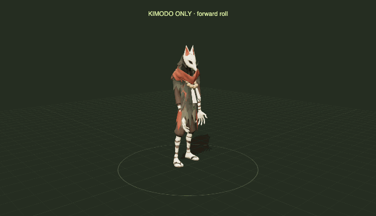

<p align="center">
  
</p>

<h1 align="center">Atelier</h1>

<p align="center"><b>Make 3D games by directing AI.</b><br>
Describe a character, a prop or a whole island; AI agents turn it into models, rigs, animation, code and a playable
game with Blender, Unreal Engine 5.8 and generative models.</p>

---

Atelier is a platform for making games with AI agents: the `atelier` command (build, play, test, stream, talk to the
running game), Unreal plugins any game can switch on, browser pages for streaming, and the conventions that let
characters, animation and gameplay code fit together. Everything is text: meshes, rigs, clips, worlds and materials
come from scripts and are rebuilt by `atelier build`.

**Yorimichi**, the game in this repository, shows what it makes. Its models, rigs, animation, world and code are
generated by scripts and AI tools that agents run:

- **Cairo**, the player: a rigged character with articulated fingers and 56 animation roles (running, rolling,
  dashing and a full sword set);
- **an island built by scripts**: a coastal road, a hamlet, a city with a harbour and an arcade, a woodland lake, a
  skate pier, a zeppelin line and the Super Ultra Mega Park;
- **a fox-masked hunter** that notices you, stalks, claws, gets parried and falls;
- **native C++ skateboarding** with skate.-style flick controls, manuals, grinds, powerslides, pumping and vert;
- **sounds** cut and levelled automatically: footsteps by surface, combat cues with hit-stop and sparks;
- **phone play**: stream the game to a phone, a handheld or a friend's laptop.

<table>
  <tr>
    <td width="50%"><br><sub><b>Skateboarding.</b> Flick the right stick (or the mouse) like in skate.: a 360 flip on flat, a one-foot 180 in the bowl, a 360 tuck knee on vert, a big Christ air. In grabs the rider's hand closes on the board's edge. The native C++ runtime solves the board and rider, and retargets its animation onto Cairo every frame.</sub></td>
    <td width="50%"><br><sub><b>Sword fighting.</b> Parry windows, counters, charged strikes, hit-stop, camera shake, knock-downs. Scripted fights check the mechanics at a fixed 60 Hz.</sub></td>
  </tr>
  <tr>
    <td width="50%"><br><sub><b>An island made by scripts.</b> The city, the lake, the coast and the harbour are generated in Blender from code and imported into Unreal by the build.</sub></td>
    <td width="50%"><br><sub><b>Play on your phone.</b> The game runs on your Mac and streams to Safari: touch controls, a painted world map, travel, settings.</sub></td>
  </tr>
</table>

## Set up

```sh
git clone https://github.com/fontanierh/atelier && cd atelier
git config core.hooksPath .githooks     # the pre-commit check (this repository is public)
uv sync                                 # the atelier command and its Python packages
```

### Requirements

| Tool | Version | Used for |
|---|---|---|
| macOS on Apple silicon | 15+ | the only platform tested |
| Unreal Engine | 5.8 (`/Users/Shared/Epic Games/UE_5.8`, or set `UE_ROOT`) | the games |
| Full Xcode | licence accepted, selected with `xcode-select`, macOS SDK and Metal toolchain installed | C++ and shaders; CLI tools alone are insufficient |
| Blender | 5.2.1 LTS on `PATH` (or set `BLENDER`) | meshes, rigs, clips |
| Python | 3.11+ with numpy, Pillow and fontTools (`uv sync`) | the studio and generated park signs |
| ffmpeg | 7+ on `PATH` | sound slicing, films, review sheets |
| Node | 24+ (optional) | streaming pages, H3 and Seedance scripts |
| coturn, Tailscale | (optional) | streaming to other devices (`brew install coturn`) |

Paid AI calls (Sunburst, Tripo, H3, Seedance) never run as part of a build. They need keys in a local `.env`
([.env.example](.env.example)), which git ignores.

After installing Xcode, select it, accept its licence and install Metal:

```sh
sudo xcode-select -s /Applications/Xcode.app/Contents/Developer
sudo xcodebuild -license accept
sudo xcodebuild -runFirstLaunch
xcodebuild -downloadComponent MetalToolchain
uv run atelier setup                  # compiles and links a small Metal shader to check the installation
```

For a Mac accessed over SSH, run `uv run atelier setup --headless` before compiling. On the tested installed
UE **5.8.2 CL 56702186**, this repairs the build tool's protected Documents lookup, uses explicit default build
configuration, and caps C++ and shader compiles at three workers (C++ at priority 10). It rebuilds the managed .NET build
tool and shared library under the render lock and memory guard. Originals and logs are retained in `~/.cache/atelier/toolchain/`;
other engine versions are refused without modification. Repeating it is safe. Use `--workers N` to set another cap.
This mode bypasses user and project `BuildConfiguration.xml`; pass desired build settings on the command line.
It also needs Rosetta for the managed tool's Intel protobuf compiler; setup checks this before modifying the engine.
Install it with `softwareupdate --install-rosetta --agree-to-license` if missing.
AutomationTool (UAT, used by packaging) loads its own copies of the build tool's DLLs and reads the XML config
in-process. On .NET 10, `SpecialFolder.Personal` is `~/Documents`, and looking it up waits on the macOS privacy prompt,
so a headless UAT would hang at startup. The repair therefore also patches that lookup to use `UE_HEADLESS_USER_DIR`, and
replaces UAT's shipped copies with the rebuilt ones (originals kept, restored on failure). `unreal.package` exports the
variable for UAT and the build tool it starts.

## Build Yorimichi

```sh
uv run atelier doctor yorimichi         # checks Unreal, Blender, ffmpeg, the sources and the sound masters
uv run atelier fetch yorimichi          # downloads the Sonniss sound masters (not redistributed here)
uv run atelier build yorimichi          # world, characters, sounds, effects, compile, Unreal import
uv run atelier play yorimichi           # native 1440 window, forward and optimized trees by default
uv run atelier play yorimichi --profile fullscreen
```

`atelier build yorimichi --list` shows every step; name one to run just it (and what it needs). Generated files go
to `build/yorimichi/` and the game's ignored `unreal/Content/`. When clearing `Content/`, keep the tracked
`Content/Data/SkateNative` bundle: it is source data for the skating module. The [Yorimichi README](games/yorimichi/README.md)
lists the play profiles, the QA scenarios and the game's docs.

Keep a completed build and Unreal's shared derived-data cache for subsequent work. A new agent worktree at the
same source revision can reuse independent copies of the generated assets and compiled modules:

```sh
(cd ../fresh-worktree && uv run atelier fetch yorimichi)  # obtain the same optional source inputs first
uv run atelier reuse yorimichi --from ../completed-checkout --to ../fresh-worktree
cd ../fresh-worktree && uv sync
uv run atelier build yorimichi          # confirms the carried-over steps are up to date
uv run atelier play yorimichi
```

Fetch in the target first: optional downloaded sources can select additional recipe steps. For example, the
community park's source GLB enables its steps and feeds the city, terrain and map. If a source present in the
completed checkout cannot be fetched in the target, resolve that mismatch before reusing; a clean matching Git
revision is necessary but does not cover these inputs.

The reuse command checks source fingerprints, outputs, engine version and compiled module build IDs before writing
stamps. On APFS it uses independent copy-on-write clones. It excludes mutable `Intermediate`, logs and capture
evidence. Code changes still rebuild the affected module or assets. Agents share the machine's render board and
lock, with one game or compile at a time; [AGENTS.md](AGENTS.md) describes the board and resource logs.
The [agent messaging board](docs/AGENT_BOARD.md) delivers addressed handoffs and lack-of-progress notices
to background subscribers across worktrees (`atelier board`).

## Start your own game

```sh
uv run atelier new moon_garden --title "Moon Garden"  # a new game, copied from the sandbox and renamed
uv run atelier build moon_garden                      # compiles it and makes its level
uv run atelier play moon_garden                       # WASD or a controller
```


With the game running, talk to it from another terminal:

```sh
uv run atelier live py "unreal.LiveLibrary.say('Hello from the terminal', 8.0)"
uv run atelier live py "unreal.LiveLibrary.spawn_model('lantern', 'games/yorimichi/assets/props/stone-lantern/stone_lantern.glb', unreal.LiveLibrary.aim_point(1500), 0, 1.5, 'box', '')"
uv run atelier live shot                              # a screenshot, path printed
```

Where to go next, in the order most games grow:

1. **Your world.** Add a step to `games/moon_garden/build.py` that runs a Blender script (`Blender(...)`) to generate
   meshes, and an Unreal script (`UnrealScript(...)`) that imports them. `atelier build` reruns only what changed.
   Yorimichi's [build.py](games/yorimichi/build.py) has examples from textures to a whole city.
2. **Your props.** Copy `make_prop.py` ([below](#a-prop-from-a-sentence-into-the-running-game)), put your keys in
   `.env`, describe things.
3. **Your character.** Follow the [character pipeline](#making-a-character). The character goes in
   `assets/characters/<name>/` with a `character.toml` and follows the humanoid bone contract, so the platform's
   animation and gameplay code fits it.
4. **Mechanics.** Switch on platform plugins in your `.uproject`: effects (`AtelierFX`), skateboarding (`Skate`; give
   your character `ISkateRider`), streaming (`AtelierStream`). Each plugin's README says what your game provides (AtelierStream's is
   [platform/web/stream](platform/web/stream/README.md)).
5. **Play anywhere.** `uv run atelier stream moon_garden start --local`, then open http://127.0.0.1:8080 (keyboard,
   mouse or a controller), or drop `--local` to reach it from your phone over Tailscale.

## What's inside

| Part | Where | What |
|---|---|---|
| The `atelier` command | [platform/studio](platform/studio/atelier) | new, doctor, fetch, build, play, stream, live, qa, lint; AI helpers for Tripo, Sunburst, H3 and Seedance; review sheets; machine safety (one heavy job at a time, optionally a small one beside it, a memory guard) |
| Engine plugins | [platform/engine/Plugins](platform/engine/Plugins) | core runtime data, animation nodes (foot planting, sailboat stance, bike grip), effects, skateboarding, streaming, the live bridge |
| Native skating | [Skate](platform/engine/Plugins/Activities/Skate/README.md) | C++ board and rider physics, Flick-It, animation, tricks, camera; tracked native data and its checks |
| Stream pages | [platform/web/stream](platform/web/stream/README.md) | the stream server, the plain player, touch controls for game pages |
| Conventions | [platform/conventions](platform/conventions) | units and axes, the humanoid bone contract, clip roles, sound cues, naming |
| Fox motion lab | [games/yorimichi/animation_lab](games/yorimichi/animation_lab/README.md) | local UniMate and Kimodo text-to-motion on the fox hunter's rig, with comparisons, custom prompts and GLB/GIF export |
| Games | [games/yorimichi](games/yorimichi/README.md), [games/sandbox](games/sandbox/README.md) | a full game, and the smallest one (the template for `atelier new`) |

[ARCHITECTURE.md](ARCHITECTURE.md) explains how the parts fit and the rules that keep the platform reusable.

## Everyday commands

| Command | What |
|---|---|
| `atelier new <game>` | start a game from the sandbox |
| `atelier doctor <game>` / `fetch <game>` | check the tools and sources; download what may not be redistributed |
| `atelier setup [--headless]` | verify Xcode and Metal; prepare the tested installed UE 5.8.2 for SSH builds |
| `atelier reuse <game> --from PATH [--to PATH]` | copy verified artifacts into a fresh worktree at the same revision |
| `atelier pool publish/restore/status <game> <step>` | [pool explicitly owned portable outputs](docs/ARTIFACT_POOL.md) across feature revisions |
| `atelier build <game> [step ...]` | build what changed; `--list`, `--force`, `--dry-run`, `--touch` |
| `atelier play <game> [--profile P]` | play under the render lock and memory guard; profiles come from the game's `game.toml` |
| `atelier live state` / `py "..."` / `shot` | work on the running game |
| `atelier qa <game> <scenario>` | run `games/<game>/scenarios/<scenario>.py` against the running game |
| `atelier stream <game> start [--local]` / `status` / `stop` | play in a browser elsewhere: `/` is the game's touch page, `/play/` the plain player |
| `atelier lint` | the public-repository rules: no secrets, no personal paths, no game names in the platform |

**Tests.** `uv run pytest` runs the studio tests (`platform/studio/tests`) and the games' Python tests. In-game
checks are QA scenarios and the `foxqa` / `swordqa` play profiles; with a local stream, the phone smoke tests in
`games/yorimichi/phone/` and `platform/web/stream/player-smoke.mjs` run in a browser.

## Native skating

The [Skate plugin](platform/engine/Plugins/Activities/Skate/README.md) runs one C++ `GameplaySession` inside Unreal.
It simulates the deck, trucks, wheels and physical rider together: contacts and constraints, steering and pushes,
Flick-It gestures, manuals and powerslides, rail selection and grinds, pumping, airs, landings and bails. Animation
graphs, procedural pose adjustments, trick scoring and the skating camera run in the same session.

It is a C++ port of the recovered Skate 3 implementation from
[2010-rust-rewrite-mashup/skate](https://github.com/chasmlol/2010-rust-rewrite-mashup/tree/7842b9e70e9aac22ed176b655dd63302618ee023/skate),
which originated in [SK8-ENGINE's skate-3-rust-engine](https://github.com/SK8-ENGINE/skate-3-rust-engine).
The game supplies nearby static collision, registered rails, controls, meshes, sounds and HUD. Cairo keeps his own
skeleton and proportions: the retargeter fits the solved animation to him, follows the solved board parts and keeps
his skinned surface above the ground during bails. Running onto the board keeps position and speed; vert assistance
sends straight airs back into the transition, with a separate input for transferring over the coping.

All the [skating data](games/yorimichi/assets/skate/README.md) is tracked in
[`Content/Data/SkateNative`](games/yorimichi/unreal/Content/Data/SkateNative): 3,334 native payloads, including
3,324 animation clips, 131,642 frames and 285 gesture patterns, plus settings, skeletons, graphs and camera data.
The build checks the bundle's manifest and hashes before compiling the C++ module; it needs no Rust toolchain,
extracted game, conversion step or separate worker process.

In Yorimichi, **Triangle / Y** (keyboard **B**) gets on or off the board, and **D-pad Down** interacts on foot. Flick
the right stick, or hold the left mouse button and flick, for tricks; **C** holds a powerslide. To pump, hold a
trigger (**Q/E**) to compress high on the descent, then release through the bottom of the curve to extend. Triggers
grab in the air; **Shift** or left stick forward requests a transfer. Full controls, tuning and the park guide are in
[Skateboarding](games/yorimichi/docs/SKATE.md).

```sh
uv run atelier build yorimichi skate.runtime       # verify the tracked native bundle
uv run atelier play yorimichi --profile desktop-1440
# From another terminal, with the game running:
uv run atelier qa yorimichi skate_runtime          # controls, animation, mounting, bails and both stances
uv run atelier qa yorimichi skatepark              # roll-ins, handrail and bowl re-entry
uv run atelier qa yorimichi skate_performance      # real-time frame pacing through six activities
```

The [runtime reference](platform/engine/Plugins/Activities/Skate/RUNTIME.md) describes the session's systems, the data
formats, the differential checks against the recovered implementation, and the limits: collision uses static
snapshots and one default surface material, and cooked builds are not covered.

## Making a character

Each step is a prompt or a script an agent runs, followed by a human look (often with a second AI reviewer). Cairo is
the example.

**1. Concepts.** A text prompt to *GPT Image 2.5 Sunburst* asks for four directions (for Cairo: "a youthful boy for a
warm Japanese exploration game, around four head heights tall, dark softly rectangular eyes without visible
whites..."). One gets picked.


**2. A turnaround for 3D.** The picked concept is redrawn in a neutral T-pose and a grey fitting suit, then from the
back and both sides, each view an edit of the approved front so the face and proportions hold.


**3. A 3D model.** The four views go to [Tripo](https://www.tripo3d.ai) (multiview to 3D, model P2) for a textured
mesh, about two minutes and 120 credits. Blender scripts then clean up details such as the brows, mouth and collar.

<table><tr>
<td width="70%"></td>
<td width="30%"></td>
</tr></table>

```sh
uv run python platform/studio/atelier/ai/tripo_asset.py generate --references <revision>/references --output <revision> --faces 8000
blender -b --python games/yorimichi/assets/characters/tools/review_tripo_model.py -- --input model.glb --output review
```

**4. A skeleton with fingers.** Tripo's auto-rig gives a 23-bone body (25 credits); a Blender script adds 30 finger
bones and reweights the hands, so the character can grip a sword or a skateboard. Every rig follows the same
[humanoid bone contract](platform/conventions/rigs/humanoid.toml), which is what lets animation, foot planting and
gameplay code work for any character.

<table><tr>
<td width="70%"></td>
<td width="30%"></td>
</tr></table>

```sh
uv run python platform/studio/atelier/ai/tripo_asset.py rig --source <cleanup>.glb --output <revision>
blender -b --python games/yorimichi/assets/characters/tools/add_tripo_fingers.py
```

**5. Outfits.** An outfit changes without changing the rig: the image model draws the outfit and dresses a headless
mannequin rendered from the rigged body, Tripo builds the clothes, and a script fits them onto the skeleton
([body swap guide](games/yorimichi/docs/BODY_SWAP_GUIDE.md)). The image model also paints the bare body green in the
same four views, so the script knows exactly which skin to keep (V necks, bare arms and legs), and coats and hakama
hang as a skirt rather than splitting into trouser legs. One command runs it all, from an outfit spec to a review
sheet, and stops before anything paid until someone has looked at the images. The same rules handle skate, hoodie,
keikogi with hakama, basketball jersey and long coat outfits
([the three fixes](games/yorimichi/docs/BODY_SWAP_GUIDE.md#13-the-three-fixes)).


**6. Motion from video.** AI video models act a move out with the character: MiniMax H3 Max at 480p by default (about
$0.15 for the dodge roll), [Seedance](https://seed.bytedance.com) when its quality justifies the cost (about $1.40 a
take), both through the Vercel AI Gateway. The video is a reference, not the animation: an agent reads it frame by
frame and writes the clip in Blender pose by pose, with foot planting and clipping checks, so it loops, lands and
reads well in the game ([H3 workflow](docs/H3_ANIMATION_REFERENCE_WORKFLOW.md)).

<table><tr>
<td width="62%"></td>
<td width="38%"></td>
</tr></table>

```sh
node --env-file=.env platform/studio/node/h3_max_reference.mjs submit --resolution 480p --out <revision>
node --env-file=.env platform/studio/node/seedance_vercel.mjs submit --out <revision>
uv run python platform/studio/atelier/review/video_reference.py <revision>        # timestamped frame sheets to author from
```

**7. Motion capture, retargeted.** For the sword, a great-sword combo from Adobe's
[Mixamo](https://www.mixamo.com/) library is moved onto Cairo's own skeleton by a Blender script. Bones are matched by
anatomy (not by axes), travel is scaled to his height, palms are aligned separately, and the second hand is re-solved
onto the grip every frame. A correction layer lifts the overhead cuts clear of his head, checked at 240 samples a
second. The combo is then cut into strikes, a charge and a parry; the capture's full-turn spin is taken out with the
feet re-planted, the strikes are sped up, and each one records where it lands so the game can aim it.

<table><tr>
<td width="34%"></td>
<td width="66%"></td>
</tr></table>

```sh
blender -b --python games/yorimichi/assets/characters/tools/cairo_mixamo_test.py -- --source combo.fbx --out <r01>
blender -b --python games/yorimichi/assets/characters/tools/cairo_mixamo_clearance.py -- --source <r01>/... --out <r02>
blender -b --python games/yorimichi/assets/characters/tools/cairo_sword_combat_r02.py   # strikes: de-spun, faster, aimed
```

The settings, the maths and the pitfalls are in the [Mixamo guide](games/yorimichi/docs/MIXAMO_WORKFLOW.md).

**8. A reviewed clip library.** Every clip is rendered from several cameras and checked before it ships. Clips are
named by [role](platform/conventions/clip-roles.toml) (`Run`, `DashAir`, `SwordParry`...), so game code asks for a
role, never for a file.


**9. Into the game.** `atelier build` exports the character from Blender (mesh, clips, sword, textures) and imports
it into Unreal; scripted QA runs then check it in motion.

```sh
atelier build yorimichi characters.cairo unreal.cairo
atelier play yorimichi --profile swordqa     # the sword against a training dummy, scripted at 60 Hz
```

The tools for each step and their options are in
[games/yorimichi/assets/characters/tools](games/yorimichi/assets/characters/tools/README.md) and
[games/yorimichi/docs](games/yorimichi/docs). The fox hunter goes through the same steps (`fox_hunter_pipeline.py`).

## Text-driven motion

The [Fox motion lab](games/yorimichi/animation_lab/README.md) runs [UniMate](https://github.com/Friedrich-M/UniMate)
and [Kimodo](https://research.nvidia.com/labs/sil/projects/kimodo/) locally on the fox hunter's own rig. One playground
at **http://127.0.0.1:8843/** compares each authored animation with its generated counterparts and creates new takes
from a prompt and seed, with playback, phase matching, rig overlays, labelled snapshots and skinned GLB export. No API
key is needed; takes go under `build/yorimichi/`. The reusable runners ([UniMate](platform/studio/atelier/ai/unimate/README.md),
[Kimodo](platform/studio/atelier/ai/kimodo/README.md)) and [retargeting helpers](platform/web/motion/README.md) live in
the platform; the fox assets, policies and UI stay with the game.

Results depend on the action. Prompt-only backflips and a forward roll are usable; generated sprints are no better
than the authored Run. The [UniMate](games/yorimichi/docs/UNIMATE_EXPERIMENT.md) and
[Kimodo](games/yorimichi/docs/KIMODO_EXPERIMENT.md) write-ups give the settings, measurements and limits.

<p align="center">
  
  <br><sub><b>UniMate backflip.</b> “A person does a backflip” · seed 99 · guidance 2 · 32 steps. No authored
  reference. The GIF repeats the full two-second take; its restart is not a synthesized loop.</sub>
</p>

<p align="center">
  
  <br><sub><b>Kimodo backflip.</b> “A person does a backflip.” · seed 99 · guidance [2, 2] · 100 steps. Three seconds
  at normal speed, no authored constraint; the GIF repeats the full take.</sub>
</p>

<p align="center">
  
  <br><sub><b>Kimodo forward roll.</b> “A person crouches down and performs one forward roll on the ground, rolling
  over their shoulders with tucked knees, then stands back up.”<br>
  Seed 56 · guidance [5, 5] · 100 steps · three seconds at normal speed. No authored constraint.</sub>
</p>

## A prop from a sentence, into the running game

Describe a prop; a couple of minutes later it stands in the world while the game runs, with no editor and no rebuild.


```sh
python games/yorimichi/assets/props/make_prop.py make stone_lantern \
  "a small weathered granite stone lantern for a roadside shrine, a little moss on the base and cap"
atelier live py "unreal.LiveLibrary.spawn_model('lantern', 'games/yorimichi/assets/props/stone_lantern/stone_lantern.glb', \
  unreal.LiveLibrary.aim_point(1500), 0, 1.3, 'box', 'workshop'); unreal.LiveLibrary.save_overlay('workshop')"
```

`make_prop.py concept` and `make_prop.py model` run the two stages separately, so the concept can be checked before
paying for a model. The **live bridge** is how agents work on a running game: `atelier live py` runs Python inside it
(spawn and move props, teleport, press buttons, put a line on screen, take screenshots), and `atelier live state`
reports where the player and the camera are. It only listens on your own machine.

## Licences of what is in this repository

The project-authored code and assets (layouts, generated meshes, the characters' source files, AI-generated
concepts and textures) are the author's. Third-party sources and data are identified below:

- **Skating**: the native C++ module ports the recovered implementation, with its
  [source licence](platform/engine/Plugins/Activities/Skate/ThirdParty/skate-core-LICENSE) retained. The tracked
  native bundle contains converted EA Skate 3 animation and gameplay records; its
  [provenance and contents](games/yorimichi/assets/skate/README.md) are documented separately.
- **Sounds** come from the Sonniss GDC Game Audio Bundles. Their licence allows shipping them inside a game but not
  redistributing them as files, so `atelier fetch` downloads the masters from the public archive and the build slices
  them. The licence also forbids using them with AI tools.
- **Mixamo** motion was retargeted onto Cairo's sword attacks and is baked into the character's source file; the
  downloaded Mixamo files are not included.
- **Fonts**: Noto Sans JP, under the SIL Open Font License (`games/yorimichi/world/regions/hidamari/fonts/OFL.txt`).
- **Engine content**: the sandbox references Unreal's basic shapes and textures; nothing from the engine is copied.
- **Packages**: Epic's Pixel Streaming libraries, express, esbuild and Playwright are installed by `npm ci` from
  `platform/web/package-lock.json`; they are not in the repository.
- **The pictures in `docs/media`** are frames from the game and from the character pipeline's own outputs; the GIFs
  have no sound.
