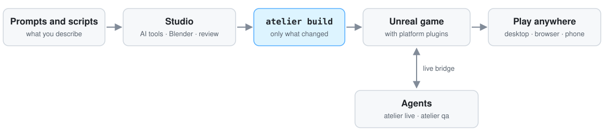

<p align="center">
  
  <br><sub><a href="#made-with-atelier-yorimichi">Yorimichi</a>, the game in this repository, made with Atelier.</sub>
</p>

<h1 align="center">Atelier</h1>

<p align="center"><b>Make 3D games by directing AI.</b><br>
Describe a character, a prop or a whole island; AI agents turn it into models, rigs, animation, code and a playable
game with Blender, Unreal Engine 5.8 and generative models.</p>

---

Atelier is a toolkit for making games with AI agents. Scripts and committed asset sources describe the meshes, rigs,
clips, worlds and materials; `atelier build` turns them into an Unreal game. Agents run every step from the terminal,
including the game itself while it plays.

## What you can do with it

- **[Make a character from a prompt](#a-character-from-a-prompt)**: concepts, a 3D model, a skeleton with fingers,
  outfits and a reviewed library of clips.
- **[Build worlds from code](#worlds-from-code)**: Blender scripts generate the meshes, the build imports them into
  Unreal and reruns only what changed.
- **[Put a prop in the running game from a sentence](#a-prop-from-a-sentence)**, with no editor and no rebuild.
- **[Get motion from text, video or motion capture](#motion-from-text-video-or-capture)**: local text-to-motion
  models, AI video references, body capture from footage, retargeted mocap.
- **[Switch on ready-made mechanics](#building-blocks)**: skateboarding, effects and streaming, as Unreal
  plugins any game can enable.
- **[Let agents drive the game](#agents-in-the-loop)**: run Python inside it, script QA checks, take screenshots and
  review sheets.
- **[Play anywhere](#play-anywhere)**: stream the game to a browser, a phone or a friend's laptop.
- **[Run several agents on one Mac](#many-agents-one-machine)**: separate worktrees, reused builds, one heavy job at
  a time under a memory guard, and a shared message board.

<p align="center">
  <picture>
    <source media="(prefers-color-scheme: dark)" srcset="docs/media/atelier-flow-dark.svg">
    
  </picture>
</p>

## Quick start

### Requirements

| Tool | Version | Used for |
|---|---|---|
| macOS on Apple silicon | 15+ | the only platform tested |
| Unreal Engine | 5.8 (`/Users/Shared/Epic Games/UE_5.8`, or set `UE_ROOT`) | the games |
| Full Xcode | licence accepted, selected with `xcode-select`, macOS SDK and Metal toolchain installed | C++ and shaders; CLI tools alone are insufficient |
| Blender | 5.2.1 LTS on `PATH` (or set `BLENDER`) | meshes, rigs, clips |
| Python | 3.11+ with numpy, Pillow and fontTools (`uv sync`) | the studio |
| ffmpeg | 7+ on `PATH` | sound slicing, films, review sheets |
| Node | 24+ (optional) | streaming pages, H3 and Seedance scripts |
| coturn, Tailscale | (optional) | streaming to other devices (`brew install coturn`) |

Install full Xcode and its Metal toolchain first: [Setting up a Mac](docs/SETUP.md) has the commands, and the extra
preparation a Mac reached over SSH needs (`atelier setup --headless`).

```sh
git clone https://github.com/fontanierh/atelier && cd atelier
git config core.hooksPath .githooks     # the pre-commit check (this repository is public)
uv sync                                 # the atelier command and its Python packages
uv run atelier setup                    # checks Xcode and Metal by compiling a small shader
```

Paid AI calls (Sunburst, Tripo, H3, Seedance) never run as part of a build. They need keys in a local `.env`
([.env.example](.env.example)), which git ignores.

### Your first game

```sh
uv run atelier new moon_garden --title "Moon Garden"  # a new game, copied from the sandbox and renamed
uv run atelier build moon_garden                      # compiles it and makes its level
uv run atelier play moon_garden                       # WASD or a controller
```


With the game running, talk to it from another terminal:

```sh
uv run atelier live py "unreal.LiveLibrary.say('Hello from the terminal', 8.0)"
uv run atelier live py "unreal.LiveLibrary.spawn_model('lantern', 'games/yorimichi/assets/props/stone-lantern/stone_lantern.glb', unreal.LiveLibrary.aim_point(1500), 0, 1.5, 'box', '')"
uv run atelier live shot                              # a screenshot, path printed
```

Where to go next, in the order most games grow:

1. **Your world.** Add build steps that generate meshes in Blender and import them into Unreal
   ([worlds from code](#worlds-from-code)).
2. **Your props.** Copy `make_prop.py`, put your keys in `.env` and describe things ([a prop from a sentence](#a-prop-from-a-sentence)).
3. **Your character.** Follow the [character pipeline](#a-character-from-a-prompt). The character goes in
   `assets/characters/<name>/` with a `character.toml` and follows the humanoid bone contract, so the platform's
   animation and gameplay code fits it.
4. **Mechanics.** Switch on platform plugins in your `.uproject`: effects (`AtelierFX`), skateboarding (`Skate`; give
   your character `ISkateRider`), streaming (`AtelierStream`). Each plugin's README says what your game provides.
5. **Play anywhere.** Stream it to a browser or a phone ([play anywhere](#play-anywhere)).

## Workflows

Every workflow below runs from the terminal, so an agent can drive it end to end. Several of the authoring tools
(characters, props, the fox motion lab) still live with Yorimichi, the game they were built for; a new game copies
the ones it needs.

### A character from a prompt

Each step is a prompt or a script an agent runs, followed by a human look (often with a second AI reviewer):

1. **Concepts.** A text prompt to an image model asks for four directions; one gets picked.
2. **A turnaround.** The picked concept is redrawn in a T-pose from the front, back and both sides, each view an edit
   of the approved front so the face and proportions hold.
3. **A 3D model.** The four views go to [Tripo](https://www.tripo3d.ai) for a textured mesh; Blender scripts clean
   up the details.
4. **A skeleton with fingers.** An auto-rig plus 30 finger bones, following the
   [humanoid bone contract](platform/conventions/rigs/humanoid.toml), so a hand can grip a sword or a skateboard
   and the platform's animation code works on any character.
5. **Outfits.** Clothes are drawn, modelled and fitted onto the same rig.
6. **Motion from video.** AI video models act a move out; an agent authors the clip in Blender from the frames
   (more motion sources [below](#motion-from-text-video-or-capture)).
7. **Motion capture, retargeted** onto the character's own skeleton.
8. **A reviewed clip library.** Every clip is rendered from several cameras and checked. Clips are named by
   [role](platform/conventions/clip-roles.toml) (`Run`, `DashAir`, `SwordParry`...), so game code asks for a role,
   never for a file.
9. **Into the game.** `atelier build` imports the character; QA scenarios check it in motion.

<table><tr>
<td width="50%"><br><sub><b>1. Concepts.</b> Four directions; the first is picked.</sub></td>
<td width="50%"><br><sub><b>2. Turnaround.</b> Four views for the 3D model.</sub></td>
</tr><tr>
<td width="50%"><br><sub><b>4. Skeleton.</b> The rest pose and three hand poses from the added finger bones.</sub></td>
<td width="50%"><br><sub><b>5. Outfit.</b> Concept, dressed mannequin, final character.</sub></td>
</tr></table>

<p>
<br><sub><b>8. Clip review.</b> A sword strike from three cameras, eight frames each.</sub></p>

Generation does not settle every detail. When a hand sat differently on the sword from one clip to the next, an agent
built a small [browser grip poser](games/yorimichi/docs/GRIPS.md): a person drags the fingertips on the real rigged
hand, and a runtime solver applies the saved pose in every clip. AI makes the first version, a person spots the
problem, the agent builds a tool to capture their intent, and code applies the correction consistently.

**[Making a character](docs/CHARACTER_PIPELINE.md)** walks through every step with Cairo, Yorimichi's player: the
prompts, the commands, the costs and the pitfalls.

### Worlds from code


A game's `build.py` lists its steps. A step runs a Blender script to generate meshes, or an Unreal editor script to
import them; its inputs are hashed, so `atelier build` reruns only what changed:

```python
from atelier.build import Blender, Step, UnrealScript

def steps(ctx):
    garden, importer = GAME / 'world' / 'garden.py', SCRIPTS / 'import_garden.py'
    return [
        Step('world.garden', [Blender(garden)], inputs=[garden],
             outputs=[ctx.out / 'garden' / 'manifest.json'], about='the garden meshes'),
        Step('unreal.garden', [UnrealScript(importer, 'GARDEN IMPORTED')], inputs=[importer],
             needs=['world.garden'], after=['unreal.compile'], heavy=True, about='the garden in the level'),
    ]
```

`atelier build <game> --list` shows every step; name one to run just it and what it needs. Yorimichi's
[build.py](games/yorimichi/build.py) has examples from textures to a whole city, a harbour and three skate parks.

### A prop from a sentence

Describe a prop; a couple of minutes later it stands in the world while the game runs.


```sh
uv run python games/yorimichi/assets/props/make_prop.py make stone_lantern \
  "a small weathered granite stone lantern for a roadside shrine, a little moss on the base and cap"
uv run atelier live py "unreal.LiveLibrary.spawn_model('lantern', 'games/yorimichi/assets/props/stone_lantern/stone_lantern.glb', \
  unreal.LiveLibrary.aim_point(1500), 0, 1.3, 'box', 'workshop'); unreal.LiveLibrary.save_overlay('workshop')"
```

`make_prop.py concept` and `make_prop.py model` run the two stages separately, so the concept can be checked before
paying for a model.

### Motion from text, video or capture

<table><tr>
<td width="50%"><br><sub><b>Kimodo backflip.</b> “A person does a backflip.” Seed 99, three seconds, no authored constraint.</sub></td>
<td width="50%"><br><sub><b>UniMate backflip.</b> The same prompt, seed 99, 32 steps, no authored reference.</sub></td>
</tr><tr>
<td width="50%"><br><sub><b>Kimodo forward roll.</b> “A person crouches down and performs one forward roll...” Seed 56.</sub></td>
<td width="50%"><br><sub><b>Retargeted mocap.</b> A Mixamo great-sword combo on Cairo's own skeleton.</sub></td>
</tr></table>

- **From text.** [UniMate](platform/studio/atelier/ai/unimate/README.md) and
  [Kimodo](platform/studio/atelier/ai/kimodo/README.md) run locally, with no API key. The
  [fox motion lab](games/yorimichi/animation_lab/README.md) at http://127.0.0.1:8843/ compares each authored animation
  with generated takes on the fox hunter's own rig, makes new takes from a prompt and seed, and exports skinned GLBs.
  Backflips and a forward roll come out usable; generated sprints are no better than the authored run.
- **From video.** AI video models (MiniMax H3, Seedance) act a move out with the character; an agent reads the video
  frame by frame and authors the clip in Blender, with foot planting and clipping checks
  ([H3 workflow](docs/H3_ANIMATION_REFERENCE_WORKFLOW.md)). The [GVHMR port](platform/studio/atelier/ai/gvhmr/README.md)
  recovers SMPL-X body motion from footage of one person on Apple silicon; for a locked-off camera,
  `--root-height camera` (experimental) keeps the jumps its world trajectory flattens
  ([details](platform/studio/atelier/ai/gvhmr/README.md#root-height-from-the-camera-experimental)).
- **From motion capture.** Blender scripts move a capture onto the character's own skeleton: bones matched by
  anatomy, travel scaled to its height, the second hand re-solved onto the grip every frame
  ([Mixamo guide](games/yorimichi/docs/MIXAMO_WORKFLOW.md)).

UniMate, Kimodo and GVHMR write one motion representation, so the
[retargeting helpers](platform/web/motion/README.md) work on any of them.

### Agents in the loop

The **live bridge** is how agents work on a running game. `atelier live py` runs Python inside it: spawn and move
props, teleport, press buttons, put a line on screen, take screenshots. `atelier live state` reports where the player
and the camera are. It only listens on your own machine.

```sh
uv run atelier live state                              # where the player and the camera are
uv run atelier qa yorimichi skatepark                  # a scripted check: games/<game>/scenarios/<scenario>.py
uv run python platform/studio/atelier/review/video_reference.py <take>  # timestamped frame sheets from a video
```

QA scenarios drive the game like a player and check what happens; Yorimichi's range from skating controls to frame
pacing, and some film takes for review. [Review sheets](platform/studio/atelier/review) turn clips and videos into contact sheets
that a person or a second AI can judge at a glance.

### Play anywhere


The game runs on your Mac and streams to a browser. `atelier stream <game> start --local` serves it at
http://127.0.0.1:8080 (keyboard, mouse or a controller); without `--local` it is reachable from your phone over
Tailscale. `/play/` is the plain player, and `/` serves the game's own touch page when its `game.toml` names one
(Yorimichi's has touch controls, the painted map above, travel and settings). The [stream pages](platform/web/stream/README.md) say what a game provides.

## Building blocks

| Part | Where | What |
|---|---|---|
| The `atelier` command | [platform/studio](platform/studio/atelier) | new, setup, doctor, fetch, build, reuse, pool, play, stream, live, qa, lint, board; review sheets; machine safety |
| AI runners | [platform/studio/atelier/ai](platform/studio/atelier/ai) | Tripo and image generation, UniMate, Kimodo and GVHMR, and the ledger every paid call goes through |
| Engine plugins | [platform/engine/Plugins](platform/engine/Plugins) | core runtime data, animation nodes (foot planting, sailboat stance, bike grip), effects, skateboarding, streaming, the live bridge |
| Skating | [Skate](platform/engine/Plugins/Activities/Skate/README.md) | C++ board and rider physics, Flick-It, animation, tricks, camera |
| Stream pages | [platform/web/stream](platform/web/stream/README.md) | the stream server, the plain player, touch controls for game pages |
| Motion helpers | [platform/web/motion](platform/web/motion/README.md) | retargeting generated motion onto a game's rig |
| Conventions | [platform/conventions](platform/conventions) | units and axes, the humanoid bone contract, clip roles, sound cues, naming |
| Games | [games/sandbox](games/sandbox/README.md), [games/yorimichi](games/yorimichi/README.md) | the smallest game (the template for `atelier new`), and a full one |

**Skating.** The [Skate plugin](platform/engine/Plugins/Activities/Skate/README.md) runs one C++ session
inside Unreal that simulates the deck, trucks, wheels and a physical rider together: Flick-It gestures, manuals and
powerslides, grinds, pumping, airs, landings and bails, plus the animation graphs, trick scoring and skating camera.
A game supplies the static collision, rails, controls, meshes, sounds and HUD, and gives its character
`ISkateRider`; the retargeter fits the solved animation to that character's own skeleton every frame. The
[runtime reference](platform/engine/Plugins/Activities/Skate/RUNTIME.md) describes its systems, data and limits.

**Conventions are what make the pieces fit.** A character that follows the humanoid bone contract gets foot
planting, the animation nodes and skating; a clip named by role plays wherever a game asks for that role. Platform code never names
a game. [ARCHITECTURE.md](ARCHITECTURE.md) explains how the parts fit and the rules that keep the platform reusable.

## Many agents, one machine

Atelier is built for several AI agents working on one Mac at once, each in its own Git worktree.

- **Reuse a build.** A fresh worktree at the same clean revision takes independent copy-on-write clones of a
  completed checkout's generated assets and compiled modules. The command checks source fingerprints, outputs, the
  engine version and module build IDs, and refuses stale, dirty or mismatched sources; code changes still rebuild what
  they touch.

  ```sh
  uv run atelier reuse yorimichi --from ../completed-checkout --to ../fresh-worktree
  cd ../fresh-worktree && uv sync && uv run atelier build yorimichi   # confirms the carried-over steps
  ```

- **Pool portable outputs** across feature revisions with `atelier pool` ([artifact pool](docs/ARTIFACT_POOL.md)).
- **One heavy job at a time.** `atelier build` and `atelier play` take the machine's render lock (one big slot,
  optionally a small one beside it) and run Unreal and Blender under a memory guard that stops a job before it
  exhausts the machine. [AGENTS.md](AGENTS.md) describes the render board and the resource logs.
- **A message board between agents.** `atelier board` delivers addressed handoffs and lack-of-progress notices to
  background subscribers across worktrees, with a web view ([agent board](docs/AGENT_BOARD.md)).
- **Paid AI calls are recorded before they are sent.** The ledger writes the record first, refuses a call whose record
  already exists and never retries one, so a rerun cannot pay again for the same revision.
- **The repository is public.** `atelier lint` and the pre-commit hook refuse secrets, personal paths and game names in
  the platform.

## Commands

| Command | What |
|---|---|
| `atelier new <game>` | start a game from the sandbox |
| `atelier doctor <game>` / `fetch <game>` | check the tools and sources; download what may not be redistributed |
| `atelier setup [--headless]` | verify Xcode and Metal; prepare the tested installed UE 5.8.2 for SSH builds |
| `atelier reuse <game> --from PATH [--to PATH]` | copy verified artifacts into a fresh worktree at the same revision |
| `atelier pool publish/restore/status <game> <step>` | [pool explicitly owned portable outputs](docs/ARTIFACT_POOL.md) across feature revisions |
| `atelier build <game> [step ...]` | build what changed; `--list`, `--force`, `--dry-run`, `--touch` |
| `atelier play <game> [--profile P]` | play under the render lock and memory guard; profiles come from the game's `game.toml` |
| `atelier live state` / `py "..."` / `shot` | work on the running game |
| `atelier qa <game> <scenario>` | run `games/<game>/scenarios/<scenario>.py` against the running game |
| `atelier stream <game> start [--local]` / `status` / `stop` | play in a browser elsewhere: `/play/` is the plain player, `/` the game's touch page when it has one |
| `atelier board` | messages and handoffs between agents ([guide](docs/AGENT_BOARD.md)) |
| `atelier lint` | the public-repository rules: no secrets, no personal paths, no game names in the platform |

**Tests.** `uv run pytest` runs the studio tests (`platform/studio/tests`) and the games' Python tests. In-game
checks use QA scenarios through the live bridge; with a local stream, the phone smoke tests in
`games/yorimichi/phone/` and `platform/web/stream/player-smoke.mjs` run in a browser.

## Made with Atelier: Yorimichi

Yorimichi (寄り道, "a detour on the way home") is a painterly Japanese island: walk, climb, swim and glide through a
coastal countryside, a forest hamlet and a harbour city, sail a dinghy, ride the zeppelin, skate three parks and fight
a fox-masked hunter with a sword. Its models, rigs, animation, world and code were made with the workflows above.

<table>
  <tr>
    <td width="50%"><br><sub><b>Skateboarding.</b> Flick the right stick (or the mouse) for a 360 flip on flat, a one-foot 180 in the bowl, a 360 tuck knee on vert, a big Christ air. The Skate plugin solves the board and rider and retargets the animation onto Cairo every frame.</sub></td>
    <td width="50%"><br><sub><b>Sword fighting.</b> Parry windows, counters, charged strikes, hit-stop, camera shake, knock-downs. Scripted fights check the mechanics at a fixed 60 Hz.</sub></td>
  </tr>
</table>

- **Cairo**, the default player, with articulated fingers and a
  [merged move set](games/yorimichi/assets/characters/adventure/README.md) for running, jumping, dodging, climbing,
  swimming, sword fighting and gliding;
- **[Modori](games/yorimichi/assets/characters/modori/README.md)**, the playable rival in a long cloth coat, with the
  same moves retargeted onto his own rig;
- **an island built by scripts**: a coastal road, a hamlet, a city with a harbour and an arcade, a woodland lake and
  a zeppelin line;
- **three skate parks**: the skate pier, the community skate park and the Super Ultra Mega Park;
- **sounds** cut and levelled automatically: footsteps by surface, combat cues with hit-stop and sparks;
- **phone play** through the streaming plugin.

The clone contains the game's model, texture, collision and animation sources in
[its asset library](games/yorimichi/assets/README.md), so a build needs no AI credentials; `atelier fetch` downloads
the sound masters:

```sh
uv run atelier doctor yorimichi         # checks Unreal, Blender, ffmpeg, the sources and the sound masters
uv run atelier fetch yorimichi          # downloads the sound masters
uv run atelier build yorimichi          # world, characters, sounds, effects, compile, Unreal import
uv run atelier play yorimichi           # native 1440 window
```

The [Yorimichi README](games/yorimichi/README.md) covers the rest: play profiles, QA scenarios, the world and its
regions, the characters, the controls, packaging and the game's docs.
