<p align="center">
  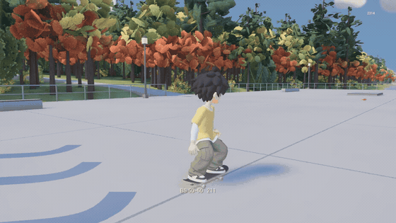
</p>

<h1 align="center">Atelier</h1>

<p align="center"><b>Make real 3D games by directing AI.</b><br>
Describe a character, a prop or a whole island. AI agents turn it into models, rigs, animation, code and a game you
can play, with Blender, Unreal Engine 5 and today's generative models doing the heavy lifting.</p>

---

**Yorimichi**, the game in this repository, was made by directing AI coding agents. Almost everything in it (models,
rigs, animation, the world, the code) came from prompts, scripts and review loops that the agents ran:

- **Cairo**, the player: from four AI concepts to a rigged 3D character, then 53 bones with articulated
  fingers and **110 animations** (running, rolling, a full sword set, and 54 skateboarding clips);
- **a whole island** built by scripts: a coastal road, a hamlet, a city with a harbour and an arcade, a woodland lake,
  a skate pier, a zeppelin line, and **204,000 plants** placed by a generator;
- **a fox-masked hunter** that notices you, stalks, claws, gets parried and falls;
- **skateboarding** with skate.-style flick controls: 14 tricks, manuals, grinds, slides, vert;
- **635 sounds** cut and levelled automatically, footsteps by surface, hit-stop and sparks;
- **play on your phone**, or stream to a handheld or a friend's laptop.

Atelier is everything that made that possible, pulled out so you can make your own game with it. A fresh clone
builds the whole game in 11 minutes (35 steps, [verified](docs/MIGRATION.md)).

<table>
  <tr>
    <td width="50%">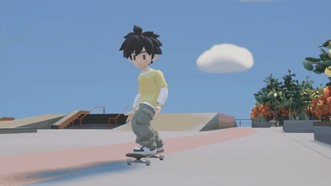<br><sub><b>Skateboarding.</b> Flick the right stick (or the mouse) like in skate.: ollies, kickflips, grabs, 360 flips, grinds. 54 rider clips, authored by an agent from AI pose sheets.</sub></td>
    <td width="50%">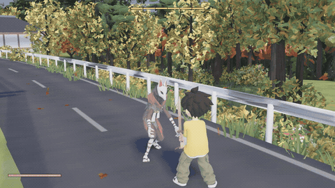<br><sub><b>Sword fighting.</b> Parry windows, counters, charged strikes, hit-stop, camera shake, knock-downs. A scripted duel checks every fight mechanic after each change.</sub></td>
  </tr>
  <tr>
    <td width="50%">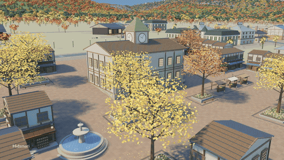<br><sub><b>An island made by scripts.</b> The city, the lake, the coast and the harbour are generated in Blender from code and imported into Unreal by the build.</sub></td>
    <td width="50%">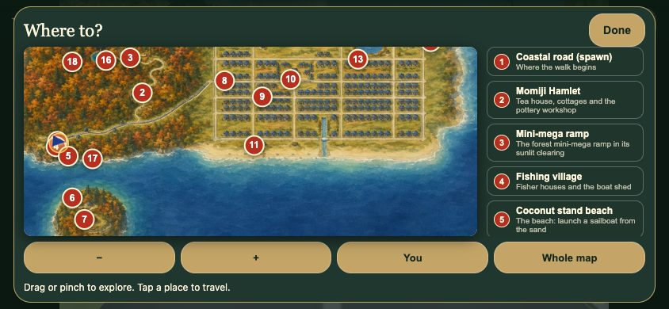<br><sub><b>Play on your phone.</b> The real game runs on your Mac and streams to Safari: touch controls, a painted world map, travel, settings.</sub></td>
  </tr>
</table>

## From an idea to a playable character

This is how Cairo was made, with the real files. Every step is a prompt or a script an agent ran, followed by a look
from a human (and often a second AI reviewer).

**1. Four ideas.** A text prompt to OpenAI's image model (*GPT Image 2.5 Sunburst*) asks for four directions for "a
youthful boy for a warm Japanese exploration game, around four head heights tall, dark softly rectangular eyes without
visible whites...". About 30 seconds each. One gets picked.

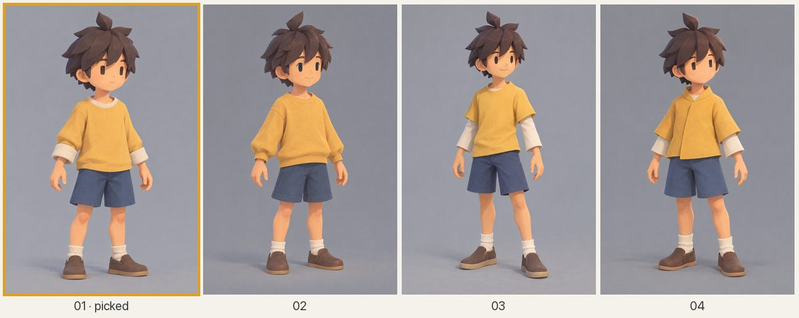

**2. A turnaround for 3D.** The picked concept is redrawn in a neutral T-pose and a grey fitting suit, then from the
back and both sides, each view an edit of the approved front so the face and proportions hold.

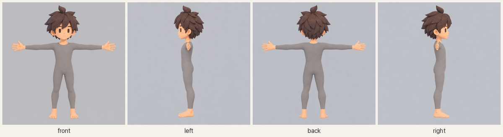

**3. A 3D model.** The four views go to [Tripo](https://www.tripo3d.ai) (multiview to 3D, model P2): a textured mesh
in about two minutes for 120 credits. Blender scripts then clean up the brows, mouth and collar.

<table><tr>
<td width="70%">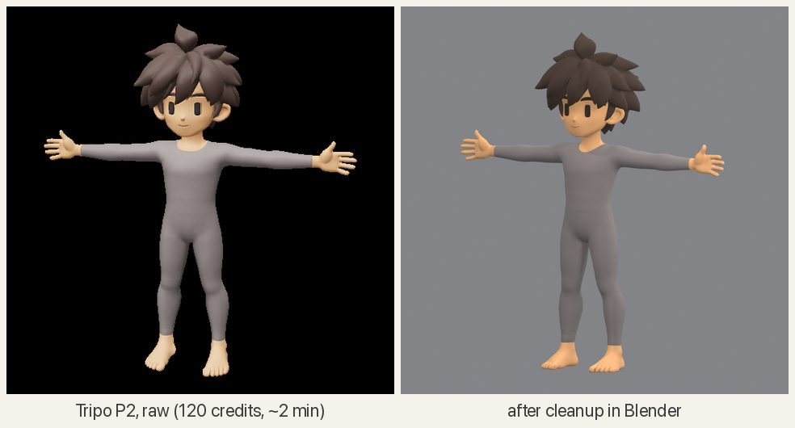</td>
<td width="30%">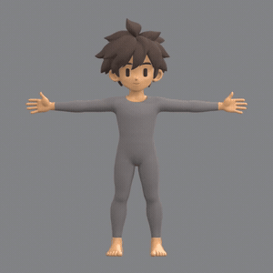</td>
</tr></table>

```sh
python platform/studio/atelier/ai/tripo_asset.py generate --references <revision>/references --output <revision> --faces 8000
blender -b --python games/yorimichi/assets/characters/tools/review_tripo_model.py -- --input model.glb --output review
```

**4. A skeleton, with fingers.** Tripo's auto-rig gives a 23-bone body (25 credits); a Blender script adds 30 finger
bones and reweights the hands, so Cairo can grip a sword or a skateboard. Every rig follows the same
[humanoid bone contract](platform/conventions/rigs/humanoid.toml), which is what lets animation, foot planting and
gameplay code work for any character.

<table><tr>
<td width="70%">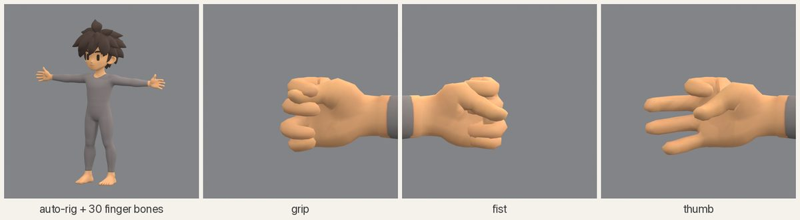</td>
<td width="30%">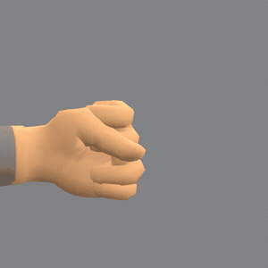</td>
</tr></table>

```sh
python platform/studio/atelier/ai/tripo_asset.py rig --source <cleanup>.glb --output <revision>
blender -b --python games/yorimichi/assets/characters/tools/add_tripo_fingers.py
```

**5. New clothes.** Change your mind about the outfit and keep the rig: the image model draws the new outfit, dresses a
headless mannequin rendered from the rigged body, Tripo builds the clothes, and a script fits them onto the skeleton
([body swap guide](games/yorimichi/docs/BODY_SWAP_GUIDE.md)). The image model also paints the bare body green in the
same four views, so the script knows exactly which skin to keep (V necks, bare arms and legs), and coats and hakama
hang as a skirt instead of splitting into trouser legs. One command runs it all, from an outfit spec to a review sheet, and stops before
anything paid until someone has looked at the images. Five outfits (skate, hoodie, keikogi with hakama, basketball
jersey, long coat) run on the same rules with no per-outfit changes
([section 13](games/yorimichi/docs/BODY_SWAP_GUIDE.md#13-the-three-fixes)).

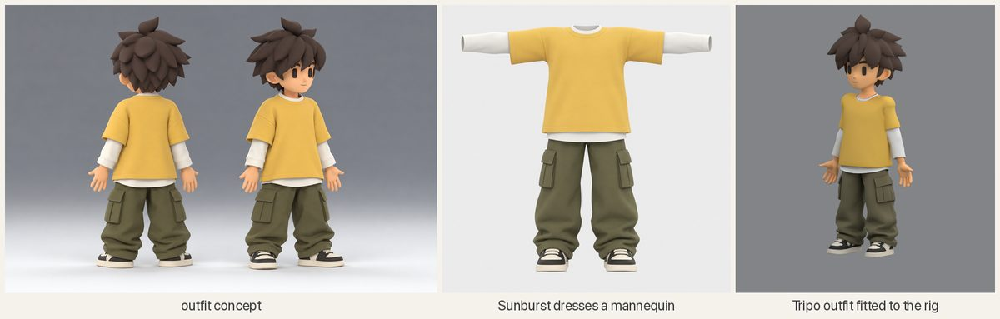

**6. Motion from video.** AI video models act a move out with the character: MiniMax H3 Max for the dodge roll
(about $0.15 at 480p), [Seedance](https://seed.bytedance.com) for the sprint and the dive roll (about $1.40 a take),
both through the Vercel AI Gateway. The video is a reference, not the animation: an agent reads it frame by frame and
writes the clip in Blender pose by pose, with foot planting and clipping checks, so it loops, lands and reads well in
the game.

<table><tr>
<td width="62%">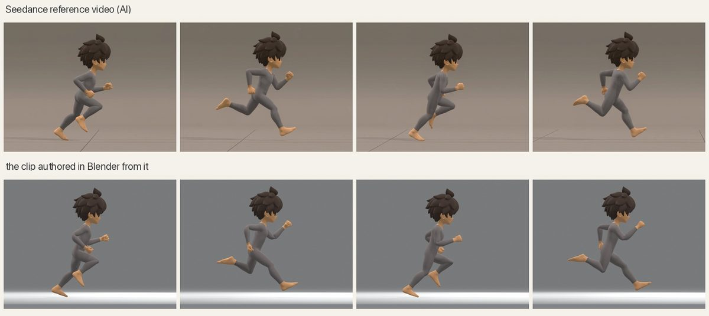</td>
<td width="38%">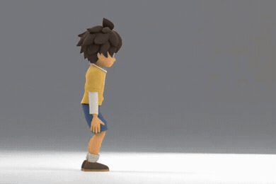</td>
</tr></table>

```sh
node --env-file=.env platform/studio/node/h3_max_reference.mjs submit --resolution 480p --out <revision>
node --env-file=.env platform/studio/node/seedance_vercel.mjs submit --out <revision>
python platform/studio/atelier/review/video_reference.py <revision>        # timestamped frame sheets to author from
```

**7. Motion capture, retargeted.** For the sword, a real capture beat any video: a great-sword combo from Adobe's free
[Mixamo](https://www.mixamo.com/) library, moved onto Cairo's own skeleton by a Blender script. Bones are matched by
anatomy (not by axes), travel is scaled to his height, palms are aligned separately, and the second hand is re-solved
onto the grip every frame. A correction layer lifts the overhead cuts clear of his big head, checked at 240 samples a
second. Then the combo is cut into strikes, a charge and a parry, the capture's full-turn spin is taken out with the
feet re-planted, the strikes are sped up, and each one records where it lands so the game can aim it.

<table><tr>
<td width="34%">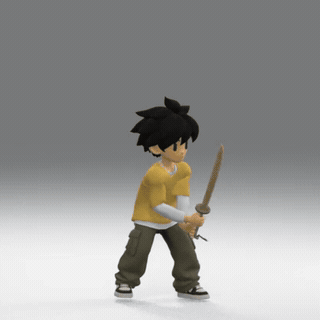</td>
<td width="66%">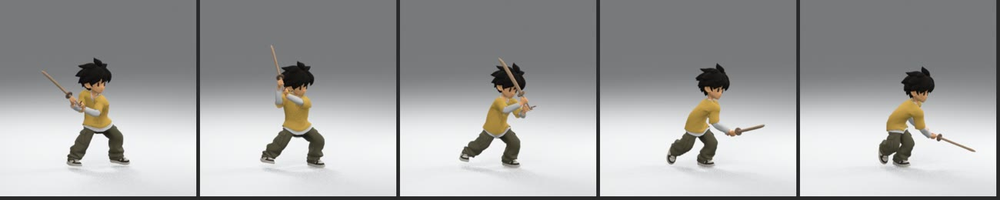</td>
</tr></table>

```sh
blender -b --python games/yorimichi/assets/characters/tools/cairo_mixamo_test.py -- --source combo.fbx --out <r01>
blender -b --python games/yorimichi/assets/characters/tools/cairo_mixamo_clearance.py -- --source <r01>/... --out <r02>
blender -b --python games/yorimichi/assets/characters/tools/cairo_sword_combat_r02.py   # strikes: de-spun, faster, aimed
```

The whole route, with the settings, the maths and the pitfalls, is in the
[Mixamo guide](games/yorimichi/docs/MIXAMO_WORKFLOW.md).

**8. A library of clips, reviewed.** Every clip is rendered from several cameras and checked before it ships. Cairo
has 110 of them, named by [role](platform/conventions/clip-roles.toml) (`Run`, `SwordParry`, `SkateGrabIndy`...), so
game code asks for a role, never for a file.

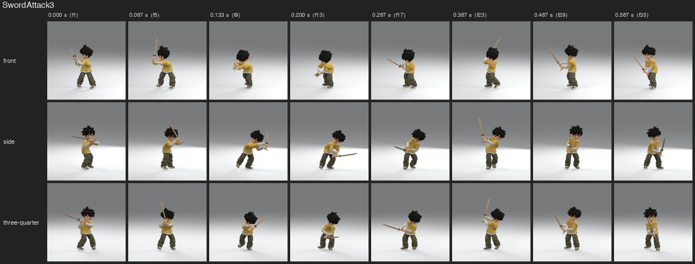

**9. Into the game.** `atelier build` exports the character from Blender (mesh, clips, sword, textures) and imports
it into Unreal; scripted QA runs then check it in motion.

```sh
atelier build yorimichi characters.cairo unreal.cairo
atelier play yorimichi --profile swordqa     # a scripted duel: draws, chains, charges, parries, 16 strikes checked
```

The tools for each step, their options and the lessons learned are in
[games/yorimichi/assets/characters/tools](games/yorimichi/assets/characters/tools/README.md) and
[games/yorimichi/docs](games/yorimichi/docs). The second character, the fox hunter, went through the same steps
(`fox_hunter_pipeline.py`).

## Text-driven motion experiments

The [Fox motion lab](games/yorimichi/animation_lab/README.md) runs [UniMate](https://github.com/Friedrich-M/UniMate)
locally on the fox hunter's own rig. Compare each authored animation with its generated counterparts in a 3D
playground, or create independent animations with a custom prompt and seed. Playback, phase matching, rig overlays,
labeled snapshots, and skinned GLB export make each take easy to inspect.

Some prompts produce useful new motion: a user-generated **backflip** worked well. Many other actions still look
poor, and generated sprints fell below the authored Run. The guided sprint was essentially the animation we already
had, with tiny arm changes; it added little useful variation.

<p align="center">
  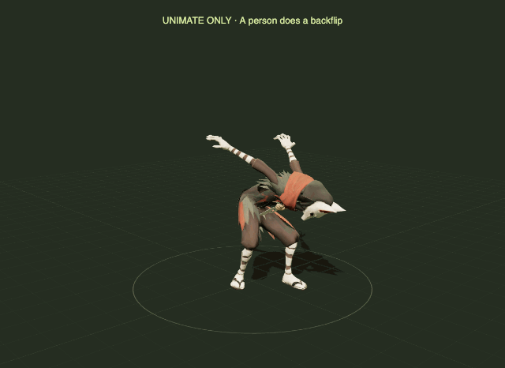
  <br><sub><b>Prompt-only backflip.</b> “A person does a backflip” · seed 99 · guidance 2 · 32 steps. No authored reference.
  The GIF repeats the full two-second take; its restart is not a synthesized loop.</sub>
</p>

The [write-up](games/yorimichi/docs/UNIMATE_EXPERIMENT.md) records the mixed results, conditioning fix, and limitations.
The [setup/run and API guide](games/yorimichi/animation_lab/README.md) includes the playground and backflip recipe;
open **http://127.0.0.1:8842/** once started. The reusable
[UniMate installer/runner](platform/studio/atelier/ai/unimate/README.md) and
[retargeting helpers](platform/web/motion/README.md) live in the platform; fox assets, policies, and UI stay with
Yorimichi. No API key is needed, and generated output goes under `build/yorimichi/unimate/`.

[Kimodo](https://research.nvidia.com/labs/sil/projects/kimodo/) now runs **headlessly on the same fox**. Its first
backflip completes a backward rotation and recovers to standing; the fairly straight airborne legs and landing
contacts still need polish. This is one promising take, with broader action quality still to be tested.

<p align="center">
  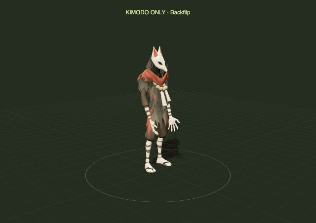
  <br><sub><b>Headless Kimodo backflip.</b> “A person does a backflip.” · seed 99 · guidance [2, 2] · 100 steps.
  Three seconds at normal speed, no authored constraint; the GIF repeats the full take.</sub>
</p>

The [Kimodo write-up](games/yorimichi/docs/KIMODO_EXPERIMENT.md) records the result and runtime limits.
The [headless command and playground guide](games/yorimichi/animation_lab/README.md#kimodo-headless-backflip)
includes custom prompts; its separate lab runs at **http://127.0.0.1:8843/**. The reusable
[Kimodo runner](platform/studio/atelier/ai/kimodo/README.md) streams the 8B text encoder within the existing memory
guard, then samples the SOMA motion and transfers it to the fox. Weights and takes stay in
`build/yorimichi/kimodo/`; the browser is for inspection and export, not inference.

## A prop from a sentence, straight into the running game

Type what you want; a couple of minutes later it stands in the world, while the game is running. No editor, no
rebuild.

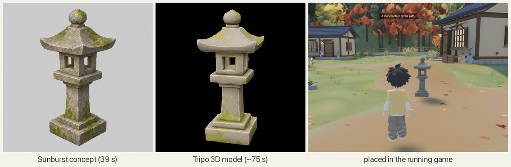

```sh
python games/yorimichi/assets/props/make_prop.py make stone_lantern \
  "a small weathered granite stone lantern for a roadside shrine, a little moss on the base and cap"
atelier live py "unreal.LiveLibrary.spawn_model('lantern', 'games/yorimichi/assets/props/stone_lantern/stone_lantern.glb', \
  unreal.LiveLibrary.aim_point(1500), 0, 1.3, 'box', 'workshop'); unreal.LiveLibrary.save_overlay('workshop')"
```

The **live bridge** is how agents work on a running game: `atelier live py` runs Python inside it (spawn and move
props, teleport, press buttons, put a line on screen, take screenshots), and `atelier live state` reports where the
player and the camera are. It only listens on your own machine.

## Start your own game

You need a Mac with Apple silicon, [Unreal Engine 5.8](https://www.unrealengine.com),
[Blender 5.2](https://www.blender.org) and [uv](https://docs.astral.sh/uv/). Then:

```sh
git clone https://github.com/fontanierh/atelier && cd atelier
uv sync                                               # the atelier command and its Python packages
uv run atelier new moon_garden --title "Moon Garden"  # a new game, copied from the sandbox and renamed
uv run atelier build moon_garden                      # compiles it and makes its level: about a minute
uv run atelier play moon_garden                       # WASD or a controller
```

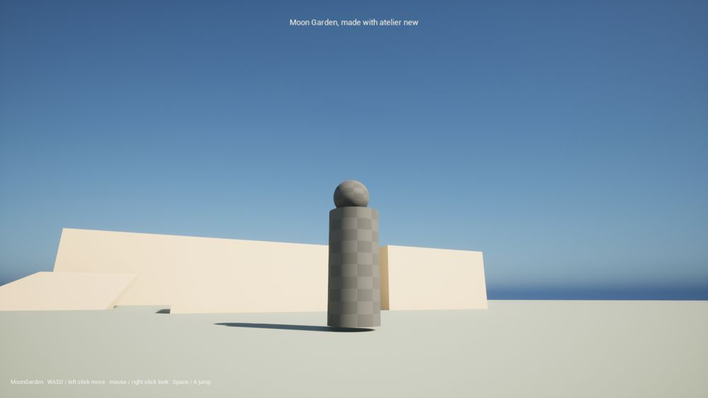

With the game running, talk to it from another terminal:

```sh
uv run atelier live py "unreal.LiveLibrary.say('Hello from the terminal', 8.0)"
uv run atelier live py "unreal.LiveLibrary.spawn_model('lantern', 'games/yorimichi/assets/props/stone-lantern/stone_lantern.glb', unreal.LiveLibrary.aim_point(1500), 0, 1.5, 'box', '')"
uv run atelier live shot                              # a screenshot, path printed
```

Where to go next, in the order most games grow:

1. **Your world.** Add a step to `games/moon_garden/build.py` that runs a Blender script (`Blender(...)`) to generate
   meshes, and an Unreal script (`UnrealScript(...)`) that imports them. `atelier build` reruns only what changed.
   Yorimichi's [build.py](games/yorimichi/build.py) has 35 examples, from textures to a whole city.
2. **Your props.** Copy `make_prop.py`, put your keys in `.env` (see [.env.example](.env.example)), describe things.
3. **Your character.** Follow the eight steps above. The character goes in `assets/characters/<name>/` with a
   `character.toml` and follows the humanoid bone contract, so the platform's animation and gameplay code fits it.
4. **Mechanics.** Switch on platform plugins in your `.uproject`: effects (`AtelierFX`), skateboarding (`Skate`; give
   your character `ISkateRider`), streaming (`AtelierStream`). Each plugin's README says what your game provides.
5. **Play anywhere.** `uv run atelier stream moon_garden start --local`, then open http://127.0.0.1:8080 (keyboard,
   mouse or a controller), or drop `--local` to reach it from your phone over Tailscale.

## Build Yorimichi

```sh
git config core.hooksPath .githooks     # the pre-commit check (this repository is public)
uv sync
uv run atelier doctor yorimichi         # checks Unreal, Blender, ffmpeg, the sources and the sound masters
uv run atelier fetch yorimichi          # downloads the Sonniss sound masters (not redistributed here)
uv run atelier build yorimichi          # world, characters, sounds, effects, compile, Unreal import: 11 minutes
uv run atelier play yorimichi           # 1080p window; --profile desktop for the 1440p desktop look
```

Generated files go to `build/yorimichi/` and the game's ignored `unreal/Content/`, both safe to delete.
`atelier build yorimichi --list` shows every step; name one to run just it (and what it needs).

## What's inside

| Part | Where | What |
|---|---|---|
| The `atelier` command | [platform/studio](platform/studio/atelier) | new, doctor, fetch, build, play, stream, live, qa, lint; AI helpers for Tripo, Sunburst, H3 and Seedance; review sheets; machine safety (one heavy job at a time, a memory guard) |
| Engine plugins | [platform/engine/Plugins](platform/engine/Plugins) | core runtime data, animation nodes (foot planting, skate rider, sailboat stance), effects, skateboarding, streaming, the live bridge |
| Stream pages | [platform/web/stream](platform/web/stream/README.md) | the stream server, the plain player, touch controls for game pages |
| Conventions | [platform/conventions](platform/conventions) | units and axes, the humanoid bone contract, clip roles, sound cues, naming |
| Fox motion lab | [games/yorimichi/animation_lab](games/yorimichi/animation_lab/README.md) | local UniMate/Kimodo experiments, headless generation, original/counterpart comparisons, custom prompts, GLB/GIF export; shared platform runners |
| Games | [games/yorimichi](games/yorimichi), [games/sandbox](games/sandbox) | a full game, and the smallest one (the template for `atelier new`) |

[ARCHITECTURE.md](ARCHITECTURE.md) explains how the parts fit and the rules that keep the platform reusable.
Everything is text: meshes, rigs, clips, worlds and materials come from scripts and are rebuilt by `atelier build`.

## Everyday commands

| Command | What |
|---|---|
| `atelier new <game>` | start a game from the sandbox |
| `atelier build <game> [step ...]` | build what changed; `--list`, `--force`, `--dry-run`, `--touch` |
| `atelier play <game> [--profile P]` | play; Yorimichi's profiles: `play`, `desktop`, `desktop-1440`, `foxqa`, `swordqa` |
| `atelier live state` / `py "..."` / `shot` | work on the running game |
| `atelier qa <game> <scenario>` | run a scenario; Yorimichi: `skate` (with the game running), `sailboat`, `zeppelin`, `lake` |
| `atelier stream <game> start [--local]` / `status` / `stop` | play in a browser elsewhere: `/` is the game's touch page, `/play/` the plain player |
| `atelier lint` | the public-repository rules: no secrets, no personal paths, no game names in the platform |

**Checks.** `uv run python -m unittest discover -s platform/studio/tests` for the studio. For Yorimichi on a fresh
build: skate (22 cases), `foxqa`, `swordqa`, sailboat (53 checks), zeppelin and lake all pass; with a local stream, so
do the phone tests in `games/yorimichi/phone/` and `platform/web/stream/player-smoke.mjs`.

## Requirements

| Tool | Version | Used for |
|---|---|---|
| macOS on Apple silicon | 15+ | the only platform tested so far |
| Unreal Engine | 5.8 (`/Users/Shared/Epic Games/UE_5.8`, or set `UE_ROOT`) | the games |
| Blender | 5.2.1 LTS on `PATH` (or set `BLENDER`) | meshes, rigs, clips |
| Python | 3.11+ with numpy and Pillow (`uv sync`) | the studio |
| ffmpeg | 7+ on `PATH` | sound slicing, films, review sheets |
| Node | 24+ (optional) | streaming pages, H3 and Seedance scripts |
| coturn, Tailscale | (optional) | streaming to other devices (`brew install coturn`) |

Paid AI calls (Sunburst, Tripo, H3, Seedance) never run as part of a build. They need keys in a local `.env`
([.env.example](.env.example)), which git ignores.

## Licences of what is in this repository

The code and the assets made for these games (layouts, generated meshes, the characters' source files, AI-generated
concepts and textures) are the author's. Third-party material is not redistributed here:

- **Sounds** come from the Sonniss GDC Game Audio Bundles. Their licence allows shipping them inside a game but not
  redistributing them as files, so `atelier fetch` downloads the masters from the public archive and the build slices
  them. The licence also forbids using them with AI tools.
- **Mixamo** motion was retargeted onto Cairo's sword attacks and is baked into the character's source file; the
  downloaded Mixamo files are not included.
- **Fonts**: Noto Sans JP, under the SIL Open Font License (`games/yorimichi/world/regions/hidamari/fonts/OFL.txt`).
- **Engine content**: the sandbox references Unreal's basic shapes and textures; nothing from the engine is copied.
- **Packages**: Epic's Pixel Streaming libraries, express, esbuild and Playwright are installed by `npm ci` from
  `platform/web/package-lock.json`; they are not in the repository.
- **The pictures in `docs/media`** are frames from the game and from the character pipeline's own outputs; the GIFs
  have no sound.
