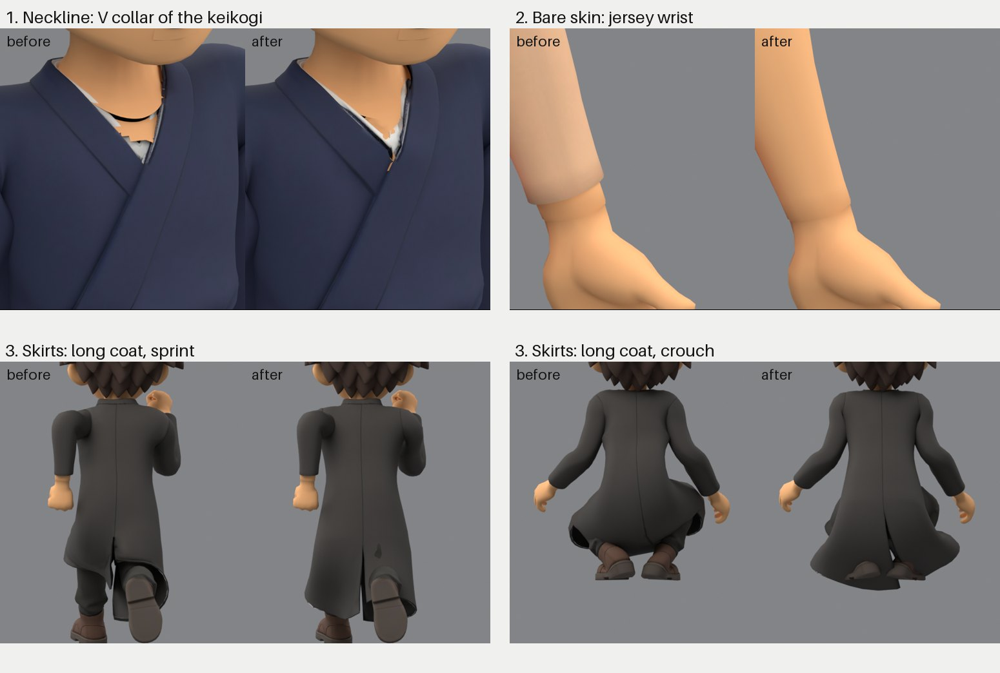

# Body swap guide: a new outfit for Cairo

The body swap dresses Cairo in a new outfit and keeps everything else: his head, hands, skeleton and clips. The image
model (GPT Image 2.5 Sunburst) draws the outfit on a headless, handless mannequin rendered from Cairo's own body in four
views, then paints the bare body flat green in the same views (the body key). Tripo builds a clothed body from the four
views. Blender scripts fit it onto the base body, keep Cairo's own skin wherever the key shows it bare, transfer the
weights, render captures and measure clipping across the clip library. One command runs every stage and stops before
anything paid, and again before Tripo until someone has looked at the images. The skate outfit in the game and four
test outfits (hoodie, keikogi with hakama, basketball jersey, long coat) run on the same rules with no per-outfit
changes (sections 12 and 13).

The idea in one line: **ask Tripo for a body that has no head and no hands**, so nothing has to be cut off afterwards.
Cutting a full generated body apart never comes out clean: the hand grows out of the cuff as one surface.

The tools read the base character from, and write every stage into, a revision folder in the prototype archive:
`$YORIMICHI_ARCHIVE/output/imagegen/yorimichi-yellow-boy-2026-09-12/<dir>/` (default `body-swap-<slug>`). Point
`YORIMICHI_ARCHIVE` at a checkout of the archive first ([tools README](../assets/characters/tools/README.md)). Paths
below such as `references/` or `qa/check.json` are inside that folder.

## The short way: one command

Write an outfit spec (section 3), then from the repository root:

```sh
export YORIMICHI_ARCHIVE=<prototype archive checkout>
T=games/yorimichi/assets/characters/tools; O=games/yorimichi/assets/characters/cairo/outfits
uv run python $T/cairo_outfit.py $O/<slug>.toml --spend     # mannequin, concept, views, key; stops for review
uv run python $T/cairo_outfit.py $O/<slug>.toml --approve "<who looked, what they checked>"
uv run python $T/cairo_outfit.py $O/<slug>.toml --spend     # Tripo, fit, assemble, captures, clipping check, review.jpg
uv run python $T/cairo_outfit.py $O/<slug>.toml --status    # what is done, what is next
```

| Stage | What it does | Cost |
| --- | --- | --- |
| `references` | the mannequin (no head, no hands), four orthographic renders | Blender |
| `concept` | the approved concept sheet redrawn in the outfit | Sunburst, about $0.07 |
| `views` | the mannequin dressed, front, back, left, right | Sunburst, about $0.28 |
| `key` | the same four views with the bare mannequin painted green | Sunburst, about $0.24 |
| `approve` | stops: look at the concept, views and keys, rerun with `--approve` | |
| `tripo` | the clothed body from the four views | Tripo, 120 credits, 2 to 4 minutes |
| `fit`, `assemble` | the Tripo body aligned on the base body; head, hands, kept skin, weights, sleeves, skirts | Blender, about 2 minutes |
| `capture` | 52 renders, 9 poses | Blender, about 3 minutes |
| `check` | clipping measured over 14 library clips | Blender, about 10 seconds |
| `sheet` | `review.jpg`: the captures to look at first, with the numbers | |
| `export` | a GLB with every clip (only with `--until export`) | Blender |

Paid stages run only with `--spend`. Tripo runs only after `--approve` has recorded the hashes of the four views in
`references/approval.json`: nobody can pay for a model from images no one has looked at, and a folder that already has
a Tripo job never pays again. Rerunning the same command continues where it stopped: a stage is skipped when its files
exist and are newer than the stage before. `--redo assemble` reruns a stage and everything after it. A Sunburst stage
that runs again under `--spend` first renames its earlier `*.provenance.json` records to `*.rejected-N.provenance.json`,
because the Sunburst tool never pays again for a call it has recorded. `--until <stage>` stops early; `--dir` and `--stem` name the revision folder and the assembled file (default `Cairo-BodySwap-<slug>`);
`--concept <image>` uses a design picked elsewhere instead of redrawing the concept sheet; `--source` picks the base
character (section 0). Blender output goes to `logs/<stage>.log`, and `outfit-run.json` records every stage run. API
keys come from the environment or the ignored `.env` of this checkout or the archive.

The result to look at first is `review.jpg`: the concept, eight captures (standing front and back, neck, wrist, sprint,
crouch, sit, double jump) and the numbers (garments found, skirt, kept skin, clipping).

## 0. Before you start

- Keys in the ignored root `.env`: `OPENAI_API_KEY` for Sunburst, `TRIPO_API_KEY`. `cairo_outfit.py` loads them itself;
  to run a stage by hand, load them with `set +x; set -a; source ./.env; set +a`. Never print them or put them on a
  command line.
- Tripo credits: one generation is 120. `uv run python platform/studio/atelier/ai/tripo_asset.py balance` shows the
  balance.
- Blender 5.2 at `/Applications/Blender.app` (or set `BLENDER`).
- The base character is a blend under the archive's character folder (an absolute path also works), set with
  `--source` or `BODY_SWAP_SOURCE`. The default, `outfit-r07/WarmOriginal-Outfit-r07.blend`, is for outfit studies.
  An outfit that goes to the game starts from a game revision, whose skeleton, clips and morphs the result keeps; the
  tools name `game-r10/WarmOriginal-Game-r10.blend` (53 bones, 25 clips including Roll, hair morphs) for that.
- To run single stages by hand, export what `cairo_outfit.py` sets:

```sh
export BODY_SWAP_DIR=body-swap-<slug> BODY_SWAP_STEM=Cairo-BodySwap-<slug> BODY_SWAP_HEADLESS=1 \
       BODY_SWAP_SOURCE=<base blend>
```

## 1. Design the outfit (optional)

The `concept` stage redraws the approved concept sheet from the spec's text, which is usually enough. To explore
designs first, add a round to `games/yorimichi/assets/characters/tools/cairo_back_concepts.py` (its `--rev` choices
and concept list) and pass the chosen picture with `--concept`. Rules for good designs: a whole-outfit redesign on the
identity captures, **flat solid colours only** (no prints, stripes, logos or patterns; graphics are added by hand
later), at most four colours, no props, hair fully visible, two figures per panel (back view left, front three-quarter
right), and a sentence about hands with five fingers. Hats need the head rebuilt; avoid them unless that is the point.

The user picks one image. That image is the only design input from there on.

## 2. Mannequin references

```sh
/Applications/Blender.app/Contents/MacOS/Blender -b --python-exit-code 1 \
  --python games/yorimichi/assets/characters/tools/cairo_body_swap_references.py -- --mannequin $BODY_SWAP_DIR
```

Writes `references/naked-{front,back,left,right}.png`: a plain grey mannequin (the body regions under the clothes,
neck and wrists capped, no head, no hands) in the bind pose, orthographic, 1024². Check that the neck cap is a clean
flat disc and the wrists end flat; a torn cap makes Sunburst draw a neck.

## 3. Dress the mannequin and key the bare body

Write an outfit spec, `games/yorimichi/assets/characters/cairo/outfits/<slug>.toml` (copy `hoodie.toml`): `name`;
`concept` describes the outfit on the character; `outfit` the same outfit for the headless mannequin (open cuffs, empty
neck opening); `pose` how it hangs in the T-pose; `front`, `back`, `left`, `right` what each view must show; `skin`
when the outfit leaves arms or legs bare. The stages run:

```sh
T=games/yorimichi/assets/characters/tools; SPEC=games/yorimichi/assets/characters/cairo/outfits/<slug>.toml
uv run python $T/cairo_body_swap_sunburst.py --headless $BODY_SWAP_DIR --outfit $SPEC --make-concept   # concept.png
uv run python $T/cairo_body_swap_sunburst.py --headless $BODY_SWAP_DIR --outfit $SPEC                  # the four views
uv run python $T/cairo_body_swap_sunburst.py --headless $BODY_SWAP_DIR --outfit $SPEC --key            # key/key-<view>.png
```

`--make-concept` redraws the approved concept sheet in the new outfit, so the character stays the same; `--concept
<image>` dresses the mannequin from a design picked elsewhere. Each image is about $0.07 at high quality; provider
replies are saved in the ignored `api-private/` folder.

**Views.** Look at all four. They must agree on hem height, collar shape, sleeve length, shoes and colours. If one view
disagrees, redo only that view with `--only back`. Never send a disagreeing set to Tripo: it costs 120 credits and comes
back wrong.

**Key.** Each dressed view comes back unchanged except that every visible bit of bare mannequin is flat green: the neck
stump and whatever chest shows in the neckline, the wrist stumps, bare arms and legs. The mannequin is Cairo's own body
seen by known cameras, so the key tells the assembly, pixel for pixel, where the outfit leaves the body bare (section
13). Check that green covers the bare body and nothing else: a white under-collar, a lining, socks or a skin-coloured
garment must stay as they are. The outfit text in the prompt is what keeps them. Redo a wrong view with `--key --only
<view>`.

## 4. Generate the body (Tripo)

`--approve "..."` writes `references/approval.json` with the four view hashes, the key hashes and the basis of the
approval. The stage then runs:

```sh
uv run python platform/studio/atelier/ai/tripo_asset.py generate --references <dir>/references --output <dir> --faces 12000
```

Two to four minutes. `job.json` is the ledger; never delete it. The FBX lands in `raw/`. Look at
`raw/output_rendered_image_url.webp`: an empty collar, open sleeves, nothing else.

## 5. Fit, assemble, capture, check

```sh
B=/Applications/Blender.app/Contents/MacOS/Blender; T=games/yorimichi/assets/characters/tools
$B -b --python-exit-code 1 --python $T/cairo_body_swap_fit.py
$B -b --python-exit-code 1 --python $T/cairo_body_swap_assemble.py
$B -b --python-exit-code 1 --python $T/cairo_body_swap_capture.py
$B -b --python-exit-code 1 --python $T/cairo_body_swap_check.py
$B -b --python-exit-code 1 --python $T/cairo_body_swap_export.py      # optional GLB
```

- **fit** aligns the Tripo body on the base body: scale by arm span onto the mannequin's wrist stumps, floor to floor,
  centred on the chest depth, then each sleeve slid onto its forearm axis. Read `fit/align.json`:
  `chest_front_clearance_mm` should be a few mm positive, `*_sleeve_slide_mm` typically 10 to 30 mm. Look at
  `fit/both-*.png` (the base body must be fully inside the outfit) and `fit/gen-*.png`.
- **assemble** builds `assembled/<stem>.blend`: opens the neck stump cap if Tripo closed it, keeps the original head and
  hands, removes the Tripo faces the key marks as body, keeps Cairo's own body wherever the key shows it bare (plus 2
  cm tucked under the garment edges) in the same skin material as the head and hands, tags each garment by shape,
  transfers weights from the base body, applies per-garment rules (sleeves ride the arm, tops never take leg weights,
  hems copy the trousers' weights, skirts hang from the hips), prunes to four influences, smooths, adds 2 mm cloth
  thickness and uses dual-quaternion skinning. Read `assembled/assembly.json`: `keyed` true; `garment_faces` lists the
  top (1) and the bottoms (3); `components.skirt_test` shows which pieces cover the midline between the legs (a skirt
  at all three heights); `kept_skin` the bare body kept per region; `key.tripo` how many Tripo faces each proof removed;
  `bones` 53; `actions` the base's clip count (25 for `game-r10`).
- **capture** renders 52 views (9 poses from four sides, plus neck and wrist close-ups) into `captures/`. Look at
  `standing--front-left`, `standing--neck`, `standing--neck-back`, `standing--wrist-left`, `sprint27--back`,
  `crouch--back`, `sit--front` and `doublejump--back` first.
- **check** poses the character through 14 library clips, 8 frames each (13 clips when the source has no Roll), and
  writes `qa/check.json`: the area of outfit triangles that pass more than 2 mm through other outfit triangles (a hem
  through a thigh, a skirt through a leg), and the area of kept skin that passes through the outfit, both minus what
  already crosses in the bind pose, in cm² at the character's 1 m scale. `summary_where` says where the crossings are. Folded creases and the inside of the crotch count too,
  so read the numbers against the skate outfit in the game (section 12). The numbers cannot see stretching (a skirt
  webbing between the legs) or colour seams; the captures can.
- **export** writes `assembled/<stem>.glb` with every clip.

## 6. Independent review

Have three independent reviewers look at the captures in parallel: the neck seam, the wrist seams, the whole body.
Give them the captures folder, the naming scheme, the instruction to crop and upscale every region with PIL and to
sample pixel colours to tell shading from holes (the background is (130, 132, 135)), and a clean / minor / blocker
table format. Save their reports as `qa/findings-<area>-r<n>.md`. Fix, re-capture, re-review; expect two to four
rounds.

Reviewers find what the author misses: palm stubs inside the cuff, the neck's open ring showing through the collar,
sleeves separating from the forearms (a 3 cm fit offset), the hem band crossing the trouser seat. Assume they will find
something.

## 7. Into the game

An accepted outfit becomes a new game revision of Cairo, promoted into this repository and built:

```sh
R="$YORIMICHI_ARCHIVE/output/imagegen/yorimichi-yellow-boy-2026-09-12"
mkdir -p "$R/game-rNN" && cp "$R/<dir>/assembled/<stem>.blend" "$R/game-rNN/WarmOriginal-Game-rNN.blend"
# game-rNN/source-manifest.json: copy games/yorimichi/assets/characters/cairo/source-manifest.json and update
# native, native_sha256, garment_source and garment_source_sha256
uv run python games/yorimichi/assets/characters/tools/promote.py cairo "$R/game-rNN"
uv run atelier build yorimichi characters.cairo unreal.cairo
```

`game-rNN` is the next unused revision (the current one is `revision` in
[character.toml](../assets/characters/cairo/character.toml)). `promote.py` copies the blend (renamed
`Cairo-Game-rNN.blend`) and its JSON records into `games/yorimichi/assets/characters/cairo/` and updates
`character.toml`; the export checks the blend against `native_sha256`. The export selects meshes by `outfit_slot` or an
unhidden `body_region`; the assembled outfit carries `body_region = outfit_body` and `equipment_id`, so it is picked
up without changes. Materials must have a base colour that is either constant or a single image texture; Tripo's
material satisfies that.

## 8. Film it in the game

The character review mode drives Cairo on a flat floor through walk, run, sprint, ground and air dashes, jump, double
jump and rolls on a fixed 60 Hz step, and logs a PASS or FAIL line per check:

```sh
for VIEW in front back; do
  D="$PWD/build/yorimichi/cairo/film/$VIEW"; mkdir -p "$D"
  uv run atelier play yorimichi -- -cairoqa -cairofilm -framestride=2 -cairoview=$VIEW "-reviewdir=$D"
  ffmpeg -framerate 30 -pattern_type glob -i "$D/frame_*.jpg" -pix_fmt yuv420p "$D.mp4"
done
```

`-cairofilm` records every frame as `frame_NNNNN.jpg` (`-framestride=2` keeps one in two: a 30 fps film);
`-cairoview` accepts `front`, `back` and `side`. The run writes `cairo.csv` (time, action, speed, height, airborne
and air-ability flags, the pelvis's up axis, the waist corrective curve) and `result.json` into the review folder. The check
"waist corrective survives runtime graph" fails with a merged body-swap outfit: it reads the original shorts'
corrective, which the outfit does not have.

## 9. Constants

All in `cairo_body_swap_assemble.py` unless noted. None of them is set per outfit, and none needed changing across the
five outfits of section 12.

| What | Value | Why | Re-measure when |
| --- | --- | --- | --- |
| key reading (`cairo_body_key.py`) | green = G > .55 and G − max(R, B) > .3; 3×3 majority; the green shrunk 3 px (about 2 mm) for the Tripo model | Sunburst leaves soft green edges; garment edges lying on the skin keep their faces | never |
| cloth in front of the green (`IN_FRONT`) | 1 cm along the view ray | green seen through a garment's edge belongs to the body behind it | never |
| on bare skin (`ON_BODY`) | ±6 mm from a bare base face; unseen faces any depth inside | Tripo's copy of a bare arm sits a few mm off Cairo's | never |
| plausible green (`plausible`) | a green key pixel counts only where the dressed view is skin-toned (R > .3, G/R .6–.9, B/R .4–.8) or plain grey | Sunburst can paint a whole ribbed cuff green | never |
| green past a garment | a green vote for a base face is dropped when the Tripo model stands more than 1 cm in front of it along the view ray | from the side, the green of a wrist deep in a sleeve's mouth, or of a neck behind a collar, would mark covered skin bare | never |
| bare specks (`_specks`) | bare islands under 8 cm² farther than 2 cm from the head and hands go back to covered | green spilled past a dark sleeve's mouth onto a dark coat leaves a skin patch on the chest | never |
| skin colour (`FAR`, `SAME_COLOUR`) | only when the key faces' median colour is a skin tone from ≥ 30 faces; a face is skin-coloured when nearer that colour than the outfit faces within 6 cm, and within .3; never where that outfit is within .15 of skin; within .08 where no outfit is near | relative to the outfit around it, so Tripo's shading and a skin-toned garment never fool it | never |
| hidden covered body | Tripo faces within 6 mm of a covered base face that no view shows as outfit make that face bare when skin-coloured faces cover more than half of it | the side of the chest inside a jersey's armhole is hidden by the arm from the side and by the jersey from the front | never |
| colour proofs | a face within 2.5 cm of bare skin, or where the key is green but it stands in front of the mannequin, is body when skin-coloured; applied after the thin-strip opening | the pale patches Tripo leaves beside a jersey's straps | never |
| thin strips (`_open`) | body marks one face wide or smaller go back to outfit | the key's edge touching a cuff rim or a strap cuts notches in the cloth | never |
| smooth cut (`contour_cut`) | each vertex takes the share of removed faces around it, smoothed 3 times; faces are split where it crosses one half | removing whole Tripo triangles leaves a saw edge at every garment border over skin | never |
| garment edges on the skin (`lift_garment_edges`) | cloth the views saw, over bare skin and up to 1.5 cm inside it, moves to 1 mm above the skin; the move fades over 4 rings (× .6 each) | Tripo's legs are thinner than Cairo's: the kept skin stands over the sock tops in a saw edge | never |
| feet | faces below the top of the sock region are never bare | Sunburst can paint a tabi's ankle green | a barefoot outfit |
| kept skin | bare base faces plus 2 cm, and 2 cm beyond the kept hands (not the head); each vertex 3 mm under the cloth along its normal, fading over 2 cm from the head and hands, but always at least 1 mm under it; bare vertices only under cloth within 6 mm | the skin continues under the garment edge and fills a cuff's mouth; unpushed skin beyond the head pokes through a crew collar in motion | never |
| garment tags | top: > 300 faces, reaches above z .10, covers the chest; bottoms: from below z −.2 to under z .03; sleeves: out on the arms | shape, not colour | a one-piece suit |
| skirt test | covers the midline between the thighs 5, 8 and 11 cm below the crotch | baggy trousers and shorts touch the midline at 5 and 8 cm, never at 11 | never |
| skirt weights | below the crotch: hips, blending to 65 % thighs at the knee, split by side over ±7 cm around the midline; full from 2 cm below the crotch, only where the cloth is 5–20 mm off the legs | swings with the legs without splitting | a floor-length skirt (a cloth simulation) |

Without key images (a stage run by hand without `key/`), fallback rules written for a tee over trousers run instead:

| What | Value | Why | Re-measure when |
| --- | --- | --- | --- |
| collar fill | r ≤ 42 mm, z ≥ .13, front half, shrunk 5 mm | covers the neck's open cut ring without peeking past the collar | a wider or lower neckline |
| neck stump cap removal | z > .15, r < 30 mm, face normal mostly vertical | opens the cap Tripo puts on the stump | a high collar or hood |
| kept forearm | 30 mm before the sleeve end (\|y\| > .30), capped, shrunk 3 mm fading at the wrist | forearm continuous with the hand, hidden inside a slimmer sleeve | sleeves ending elsewhere than the wrist (edit the .30) |
| sleeve slide (fit) | measured per side over \|y\| .25–.33 | Tripo puts the arms about 3 cm forward and 1 cm low | never; it is measured |
| sleeve vertices | tee vertices with \|y\| > .16, or above the armpit and \|y\| > .105, or nearest body was the arm | ride the upper-arm bone, blend .09–.14 | sleeveless or long-sleeved tee |
| hem copy | tee and band vertices below z −.04 copy the nearest trouser vertex within 4 cm | layers move together | a coat over bare legs (no trousers to copy) |
| garment tags | tee: > 800 faces, top above z .15, wider than \|y\| .2; trousers: reaching below z −.4 | drives the rules above | anything that is not tee-over-trousers |
| wrist stumps (references) | mannequin cut at \|y\| .335 | Sunburst ends the sleeves there | never |
| facing (fit) | headless: Tripo's multiview front is trusted; the toe test only warns | the toe test turns a long coat around (boots) | never |

## 10. Pitfalls

- **Never classify faces by baked colour alone.** Tripo paints skin colour onto the inside of cuffs and collars; a
  colour rule shortens a sleeve or punches a hole in a tee. The body key is the evidence. The colour rules (section 9)
  only extend what the key already found, compare a face with the outfit right around it rather than with a fixed
  colour, and stay off unless the key's own faces are skin-toned (on the hoodie their median was teal, and a fixed
  rule would have deleted the hoodie).
- **Check the key against the dressed view.** Sunburst sometimes paints cloth green too. Green only counts where the
  dressed view shows skin or bare grey mannequin.
- **Green can be seen past a garment.** From the side, the camera looks into a sleeve's mouth or behind a collar and
  sees a bit of wrist or neck deep inside. That skin is covered in every pose; a green vote only counts when no Tripo
  cloth stands more than 1 cm in front of the face.
- **Render a bad border with each object in its own colour before fixing it.** A saw edge at a jersey's sock tops looks
  like a bad cut in the Tripo mesh; rendered with Cairo's kept skin in green, it is the skin standing over the sock.
- **Decide skin on the base body, not on Tripo.** The key lines up with Cairo's own body exactly (it is the mannequin in
  the pictures) and only roughly with Tripo's. Decide what is bare on the base body first, then ask which Tripo faces
  lie on that bare skin.
- **A key edge is not evidence.** Cutting Tripo faces on a strip of green one face wide notches cuffs and straps; body
  marks have to be at least two faces thick.
- **Skirts are found by where they are, not by name.** Trousers and shorts reach the midline between the legs just
  below the crotch too; only the 11 cm height separates them from a skirt.
- **Align on something that exists in both meshes.** Whole-mesh means are biased by baggy clothes; the head is absent;
  legs are wide. Chest depth for front and back, arm span for scale, a per-sleeve slide for the arms.
- **Linked revision folders.** A revision that reruns new rules on another's Tripo model links that folder's files.
  `cairo_outfit.py` replaces a stage's linked outputs with its own files before it runs; a stage run by hand writes
  through the links into the other revision.
- **Check the deepest tuck.** The double jump's tuck is where the trousers' waist comes through the rear of the tee;
  check it densely sampled, not on one capture frame.
- **Creating a bmesh layer invalidates every BMVert and BMFace reference you hold.** Create layers right after
  `from_mesh`, before walking components or holding vertices.
- **Diagnostic renders must not un-hide objects.** The grey fitting-suit body is hidden by slot; a render script that
  sets `hide_render` on every object shows it through the sleeves.
- **Reviewers read the captures that exist when they start.** Re-rendering mid-review makes their findings stale;
  wait, or version the capture folders.

## 11. Known gaps

On the skate outfit in the game:

- The tee's short sleeve leaves the far-swung arm from behind in sprint and dash (the weights are right; the cause is
  not found; visible in the in-game film).
- Minor: the white band z-fights the tee rim at the front; a dark crevice at the nape corner; the hands enter the baggy
  trousers in crouch (animation, not asset).
- No corrective morphs on the outfit; one merged outfit slot replaces shirt, shorts, socks and shoes.

In general:

- The tools name `game-r10` (25 unarmed clips) as the game base. The current game revision adds the combat and armed
  clips and the bokken; before promoting an outfit built on it, check that `assembly.json` counts all its actions.
- Floor-length skirts want a cloth simulation; a barefoot outfit needs the feet rule changed (section 9).
- Tripo's UVs are hundreds of small overlapping islands. Recolours, prints or repaints of an existing outfit without a
  new generation need a repacked layout (Tripo Studio's Smart UV turned one outfit's 407 overlapping islands into 33
  clean ones).

## 12. Five outfits on the same rules

Four test outfits each break a different assumption of a round-necked tee over trousers: a hoodie with joggers (a hood
behind the neck), a keikogi with wide hakama (a V collar, wide sleeves, a near-skirt), a sleeveless basketball jersey
with shorts (bare arms and legs) and a knee-length coat (a skirt between the legs). Their specs are in
`games/yorimichi/assets/characters/cairo/outfits/`; the five assembled outfits are in the archive's
`body-swap-variants-r02/<slug>` (the skate outfit in the game is `body-swap-r02-headless`).

Clipping check (section 5): cm² at 1 m, minus the bind pose, 14 clips × 8 frames.

| Outfit | Cloth mean / skin worst | Bare base faces kept | Look |
| --- | --- | --- | --- |
| Skate (in the game) | 501 / 35 | 20 (the neck ring) | the gaps in section 11 |
| Hoodie | 115 / 52 | 0 | cuffs whole |
| Keikogi and hakama | 419 / 21 | 39 (the V) | the V shows skin down to the white under-collar; the hakama swings as one piece |
| Basketball jersey | 92 / 196 | 860 (arms, legs) | no wrist seam; armholes, straps and sock tops clean in all poses |
| Long coat | 382 / 33 | 0 | a coat in sprint and crouch; no skin patches |

The jersey's skin number is high because its arms and legs are Cairo's own skin, and the check counts every bit of it
that passes more than 2 mm into cloth: per frame, 38 of its 55 cm² are the lower legs against the shorts' hems when the
knees bend, 13 the arms and chest at the armholes. None of it shows in the captures; it is the first thing to look at
in the game. The coat's cloth number is high because the skirt hangs from the hips while the trousers under it follow
each leg: 258 of its 382 cm² are below the crotch, most of it when sitting, all of it under the coat in the captures.

Cost per outfit: nine Sunburst images (the concept, four views and four keys, about $0.60) and one Tripo generation
(120 credits). Machine time: Sunburst about 30 s per image, Tripo three to four minutes, fit and assemble two minutes,
captures three minutes.

## 13. The three fixes

Three rules make the assembly general where a tee over trousers would not be: the neckline, bare skin and skirts. The
first two come from one idea: **ask Sunburst where the body is bare.** The four dressed views are Sunburst edits of
renders of Cairo's own body (the headless mannequin) from known cameras. Asking for the same four views with the bare
mannequin painted flat green (section 3) gives a map that lines up with Cairo's body pixel for pixel. The assembly
reads it in two passes (`cairo_body_key.py`):

1. **On Cairo's body:** which faces of the base body are bare (`exposed_skin`). Those faces, plus 2 cm tucked under the
   garment edges, stay as Cairo's own skin, in the same material as the head and hands.
2. **On the Tripo model:** which faces are Tripo's copy of the body, not the outfit (`tripo_body_faces`). Those are
   removed, so the kept skin shows instead.



- **Neckline.** The skin kept is exactly what the outfit leaves bare, so a V neck shows chest down to the under-collar,
  a hoodie or a stand collar shows none, and the head's cut edge is always under cloth or skin.
- **Bare skin.** Tripo's baked arms and legs (paler than the head and hands) are removed and Cairo's own replace them,
  in the hands' material: no seam at the wrist or the knee.
- **Skirts.** A garment that covers the midline between the thighs 5, 8 and 11 cm below the crotch is a skirt (baggy
  trousers and shorts reach it at 5 and 8 cm, never at 11). Below the crotch it hangs from the hips and takes a growing
  share of both thighs, split by side (65 % at the knee), so it swings with the legs instead of splitting into trouser
  legs. The hakama counts as a skirt too.

Each outfit adds a rule the key alone does not cover; all of them run on all five outfits (constants in section 9):

| Outfit | What goes wrong with the key alone | Rule |
| --- | --- | --- |
| Skate | skin beyond the head, kept but not tucked under, pokes through the crew collar in motion | kept skin extends 2 cm beyond the hands only, and never stands in front of the outfit |
| Hoodie | Sunburst paints a whole ribbed cuff green, and the cuff is cut away | green counts only where the dressed view is skin or grey |
| Coat | from the side, green seen past the dark sleeve marks chest faces bare: a skin patch on the chest | green past more than 1 cm of Tripo cloth does not count, and small bare islands away from the head and hands are dropped |
| Jersey | the side of the chest inside the armhole is hidden in every view: a pale Tripo sheet stays | Tripo faces lying on hidden body that are skin-coloured make it bare |
| Jersey | pale patches beside the straps, and a flap of the shoulder taken for skin | skin colour judged against the outfit colour within 6 cm |
| Jersey, keikogi | saw edges where cloth meets skin: the removed Tripo triangles at the border, and Cairo's thicker leg standing over the sock tops | the smooth cut, and garment edges lifted onto the skin |

## Where things are

- Tools, in `games/yorimichi/assets/characters/tools/`: `cairo_outfit.py` (the one command),
  `cairo_body_swap_{references,sunburst,fit,assemble,capture,check,export}.py` (the stages), `cairo_body_key.py`
  (reading the key), `cairo_back_concepts.py` (design rounds), `promote.py`. The Tripo client is
  `platform/studio/atelier/ai/tripo_asset.py`; the game export is
  `games/yorimichi/assets/characters/cairo/export_unreal.py`; the Unreal import is
  `games/yorimichi/unreal/Scripts/import_cairo.py`.
- Outfit specs: `games/yorimichi/assets/characters/cairo/outfits/*.toml`.
- Per outfit, in its revision folder: `review.jpg`, `captures/`, `qa/check.json`, `qa/findings-*.md`,
  `assembled/assembly.json`, `outfit-run.json`.
