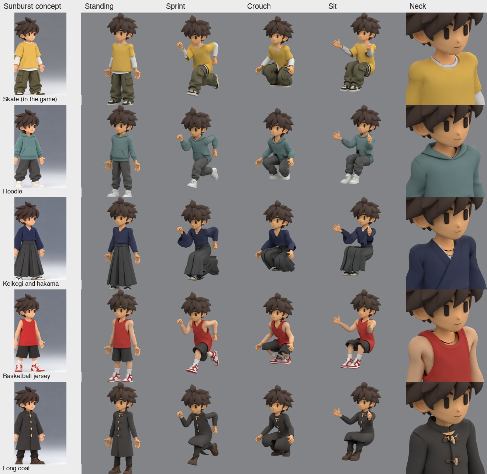

# Body swap guide: a new outfit for Cairo

> Moved from the prototype repository on 29 September 2026. Paths are translated to this repository where the file moved; paths still starting with `japan/` or `output/imagegen/` refer to the prototype archive (authoring tools, earlier revisions, review images). See [docs/MIGRATION.md](../../../docs/MIGRATION.md).

This is the procedure that produced the skate outfit (`body-swap-r02-headless`, in the game as `game-r11`, with the
frontflip waistband fix now in `game-r12`), since run on four very different outfits (section 12) and fixed where
they broke it (section 13). It generates a whole clothed body with AI, keeps the character's own head, hands and
skeleton, and plays all existing clips unchanged. One command runs it (below); the numbered sections explain each
stage, what to look at, and what to do when it goes wrong. Every stage leaves files and a ledger behind.

The idea in one line: **ask Tripo for a body that has no head and no hands**, so nothing has to be cut off
afterwards. Cutting a full generated body apart (the r01 attempt) never came out clean.

## The short way: one command

Write an outfit spec (section 3), then from the Atelier checkout:

```sh
export YORIMICHI_ARCHIVE=<prototype archive checkout>
PY=~/.cache/yorimichi/imagegen-venv/bin/python
T=games/yorimichi/assets/characters/tools; O=games/yorimichi/assets/characters/cairo/outfits
$PY $T/cairo_outfit.py $O/<slug>.toml --spend                      # mannequin, concept, views, key; stops for review
$PY $T/cairo_outfit.py $O/<slug>.toml --approve "<who looked, what they checked>"
$PY $T/cairo_outfit.py $O/<slug>.toml --spend                      # Tripo, fit, assemble, captures, clipping check, review.jpg
$PY $T/cairo_outfit.py $O/<slug>.toml --status                     # what is done, what is next
```

It writes `output/imagegen/yorimichi-yellow-boy-2026-09-12/body-swap-<slug>/` (`--dir` to choose), loads the API keys
from the ignored `.env` of either checkout, sends Blender output to `<dir>/logs/<stage>.log` and records every stage in
`<dir>/outfit-run.json`. Rerunning the same command continues where it stopped: a stage is skipped when its files
exist and are newer than the stage before. `--redo assemble` reruns a stage and everything after it. Paid stages
(concept, views and key on Sunburst, about $0.60 together; Tripo, 120 credits) run only with `--spend`, and Tripo
only after `--approve` has recorded the hashes of the four views: nobody can pay for a model from images no one has
looked at. `--concept <image>` uses a design picked elsewhere instead of redrawing the concept sheet; `--source
game-r10/WarmOriginal-Game-r10.blend` for anything that goes to the game; `--until export` also writes the GLB.

The result to look at first is `<dir>/review.jpg`: the concept, eight captures (standing front and back, neck, wrist,
sprint, crouch, sit, double jump) and the numbers (garments found, skirt, kept skin, clipping).

## 0. Before you start

- Keys in the ignored root `.env` (`OPENAI_API_KEY` for Sunburst, `TRIPO_API_KEY`). Load them with
  `set +x; set -a; source ./.env; set +a`. Never print them, never put them on a command line.
- Tripo credits: one generation is 120 credits (`tripo_asset.py balance` shows the balance).
- Blender 5.2 at `/Applications/Blender.app`, the imagegen venv at `~/.cache/yorimichi/imagegen-venv`, ffmpeg.
- The base character is the game revision, currently `game-r10/WarmOriginal-Game-r10.blend` (skeleton with 53
  bones, 25 clips including Roll, hair morphs). Its clothes are the r07 outfit; the body under them is what we
  dress. Set `BODY_SWAP_SOURCE=game-r10/WarmOriginal-Game-r10.blend` for anything that goes to the game.
- Pick a revision name and export it for every command below:

```sh
export BODY_SWAP_DIR=body-swap-r03-<slug> BODY_SWAP_STEM=WarmOriginal-BodySwap-r03 BODY_SWAP_HEADLESS=1 \
       BODY_SWAP_SOURCE=game-r10/WarmOriginal-Game-r10.blend
```

All paths below are under `output/imagegen/yorimichi-yellow-boy-2026-09-12/`.

## 1. Design the outfit (Sunburst, cheap, iterate here)

Use `games/yorimichi/assets/characters/tools/cairo_back_concepts.py` with a new round (`--rev r05`, add the concepts to the script). Rules that
made round 4 work: whole-outfit redesign on the identity captures, **flat solid colours only** (no prints,
stripes, logos or patterns: graphics are added by hand later), at most four colours, no props, hair fully
visible, two figures per panel (back view left, front three-quarter right), and a sentence about hands with
five fingers. Hats need the head rebuilt, so avoid them unless that is the point.

The user picks one image. That image is the only design input from here on.

## 2. Mannequin references

```sh
/Applications/Blender.app/Contents/MacOS/Blender -b --python-exit-code 1 \
  --python games/yorimichi/assets/characters/tools/cairo_body_swap_references.py -- --mannequin $BODY_SWAP_DIR
```

Writes `<rev>/references/naked-{front,back,left,right}.png`: a plain grey mannequin (body regions under the
clothes, neck and wrists capped, no head, no hands) in the bind pose, orthographic, 1024². Check that the neck
cap is a clean flat disc and the wrists end flat; a torn cap makes Sunburst draw a neck.

## 3. Dress the mannequin (Sunburst, four views)

Write an outfit spec, `games/yorimichi/assets/characters/cairo/outfits/<slug>.toml` (copy `hoodie.toml`): `concept`
describes the outfit on the character, `outfit` the same outfit for the headless mannequin (open cuffs, empty
neck opening), `pose` how it hangs in the T-pose, `front`/`back`/`left`/`right` what each view must show, and
`skin` when the outfit leaves arms or legs bare. Then:

```sh
T=games/yorimichi/assets/characters/tools
cp output/imagegen/yorimichi-yellow-boy-2026-09-12/body-swap-r02-headless/references/naked-*.png \
   output/imagegen/yorimichi-yellow-boy-2026-09-12/$BODY_SWAP_DIR/references/     # or render them (step 2)
~/.cache/yorimichi/imagegen-venv/bin/python $T/cairo_body_swap_sunburst.py --headless $BODY_SWAP_DIR \
  --outfit games/yorimichi/assets/characters/cairo/outfits/<slug>.toml --make-concept    # concept.png, about 30 s
~/.cache/yorimichi/imagegen-venv/bin/python $T/cairo_body_swap_sunburst.py --headless $BODY_SWAP_DIR \
  --outfit games/yorimichi/assets/characters/cairo/outfits/<slug>.toml                   # the four views
```

`--make-concept` redraws the approved skate concept sheet in the new outfit, so the character stays the same; pass
`--concept <image>` instead to dress the mannequin from a design picked elsewhere. Without `--outfit` the tool
writes the skate prompt exactly as it was for r02. About $0.07 per image at high quality (token usage is saved
in the ignored `api-private/` folder).

Look at all four images. They must agree on: hem height, collar shape, sleeve length, shoes, colours. If one
view disagrees, rerun only that view with `--only back`. Do not send a disagreeing set to Tripo; it costs 120
credits and comes back wrong.

Then the **body key**, four more images (about $0.24):

```sh
~/.cache/yorimichi/imagegen-venv/bin/python $T/cairo_body_swap_sunburst.py --headless $BODY_SWAP_DIR \
  --outfit games/yorimichi/assets/characters/cairo/outfits/<slug>.toml --key            # key/key-<view>.png
```

Each dressed view comes back unchanged except that every visible bit of bare mannequin is flat green: the neck stump
and whatever chest shows in the neckline, the wrist stumps, bare arms and legs. The mannequin is Cairo's own body seen
by known cameras, so the key tells the assembly, pixel for pixel, where the outfit leaves the body bare (section 13).
Check that green covers the bare body and nothing else: a white under-collar, a lining, socks or a skin-coloured
garment must stay as they are. The outfit text in the prompt is what keeps them; without it Sunburst keyed the skate
outfit's white sleeves. Redo a wrong view with `--key --only <view>`.

## 4. Generate the body (Tripo)

Record the approval (`cairo_outfit.py ... --approve "..."` writes `references/approval.json` with the four view
hashes, the key hashes and the basis; or write it by hand like the r02 one), then:

```sh
~/.cache/yorimichi/imagegen-venv/bin/python platform/studio/atelier/ai/tripo_asset.py generate \
  --references output/imagegen/yorimichi-yellow-boy-2026-09-12/$BODY_SWAP_DIR/references \
  --output output/imagegen/yorimichi-yellow-boy-2026-09-12/$BODY_SWAP_DIR --faces 12000
```

Two to four minutes. `job.json` is the ledger; never delete it. The FBX lands in `raw/`. Look at
`raw/output_rendered_image_url.webp`: empty collar, open sleeves, nothing else.

## 5. Fit, assemble, capture, export

```sh
B=/Applications/Blender.app/Contents/MacOS/Blender
$B -b --python-exit-code 1 --python games/yorimichi/assets/characters/tools/cairo_body_swap_fit.py
$B -b --python-exit-code 1 --python games/yorimichi/assets/characters/tools/cairo_body_swap_assemble.py
$B -b --python-exit-code 1 --python games/yorimichi/assets/characters/tools/cairo_body_swap_capture.py
$B -b --python-exit-code 1 --python games/yorimichi/assets/characters/tools/cairo_body_swap_export.py
```

What each does and what to read afterwards:

- **fit** aligns the Tripo body on the base body: scale by arm span onto the mannequin's wrist stumps, floor to
  floor, centred on the chest depth, then each sleeve slid onto its forearm axis. Read `fit/align.json`:
  `chest_front_clearance_mm` should be a few mm positive, `*_sleeve_slide_mm` typically 10 to 30 mm; look at
  `fit/both-*.png` (base body must be fully inside the outfit) and `fit/gen-*.png`.
- **assemble** builds `assembled/<stem>.blend`: opens the neck stump cap if Tripo closed it, keeps the original
  head and hands, removes the Tripo faces the key marks as body, keeps Cairo's own body wherever the key shows it
  bare (plus 2 cm tucked under the garment edges) in the same skin material as the head and hands, tags each garment
  by shape, transfers weights from the base body, applies per-garment rules (sleeves ride the arm, tops never take
  leg weights, hems copy the trousers' weights, skirts hang from the hips), prunes to four influences, smooths, adds
  2 mm cloth thickness, dual-quaternion skinning. Read `assembled/assembly.json`: `keyed` true; `garment_faces` lists
  the top (1) and the bottoms (3); `components.skirt_test` shows which pieces cover the midline between the legs
  (a skirt at all three heights); `kept_skin` the bare body kept per region; `key.tripo` how many Tripo faces each
  proof removed; `bones` 53; `actions` 25 for a game source. Without key images the older r02 rules run (a fixed
  collar patch and forearm block, garments tagged by the skate outfit's colours).
- **capture** renders 52 views (9 poses × 4 views + neck and wrist close-ups) into `captures/`. Look at
  `standing--front-left`, `standing--neck`, `standing--neck-back`, `standing--wrist-left`, `sprint27--back`,
  `crouch--back`, `sit--front`, `doublejump--back` before anything else.
- **export** writes `assembled/<stem>.glb` with all clips.

Then measure the clipping (about ten seconds, no rendering):

```sh
$B -b --python-exit-code 1 --python games/yorimichi/assets/characters/tools/cairo_body_swap_check.py
```

It poses the character through 14 library clips (8 frames each; 13 when the source has no Roll) and writes `qa/check.json`: the area of outfit triangles
that pass more than 2 mm through other outfit triangles (a hem through a thigh, a skirt through a leg), and the
area of kept skin (head, hands, forearm pieces, collar patch) that passes through the outfit, both minus what
already crosses in the bind pose. Folded creases and the inside of the crotch count too, so read it against the
skate outfit, which is in the game: cloth mean about 500 cm², skin mean about 1.7 cm², skin worst about 34 cm².
The numbers cannot see stretching (a skirt webbing between the legs) or colour seams; the captures can.

## 6. Independent QA (do not skip)

Launch three Opus reviewers in parallel with the prompts used in this session (neck seam, wrist seams, whole
body). Give them: the captures folder, the naming scheme, the instruction to crop and upscale every region with
PIL and to sample pixel colours to tell shading from holes (background is (130,132,135)), and the clean / minor /
blocker table format. Save their reports in `<rev>/qa/findings-<area>-r<n>.md` (they usually cannot write files;
copy the text). Fix, re-capture, re-review. Wrists and neck converged in three rounds on the skate outfit; the
body took four and still had one open item (see 9).

Things the reviewers found that I had not: palm stubs inside the cuff, the neck's open ring showing through the
collar, sleeves separating from forearms (which turned out to be a 3 cm fit offset), the hem band crossing the
trouser seat. Assume they will find something.

## 7. Into the game

Choose the next unused revision; `game-r12` already contains the accepted
frontflip correction. The example below uses `game-r13`.

```sh
R=output/imagegen/yorimichi-yellow-boy-2026-09-12
mkdir -p $R/game-r13 && cp $R/$BODY_SWAP_DIR/assembled/$BODY_SWAP_STEM.blend $R/game-r13/WarmOriginal-Game-r13.blend
# source-manifest.json: copy game-r11's, update native, native_sha256, garment_source(+sha256), note
/Applications/Blender.app/Contents/MacOS/Blender -b --threads 4 --python-exit-code 1 \
  --python games/yorimichi/assets/characters/cairo/export_unreal.py -- --revision game-r13 > build/yorimichi/logs/warm-export-r13.log 2>&1
"/Users/Shared/Epic Games/UE_5.8/Engine/Build/BatchFiles/Mac/Build.sh" YorimichiEditor Mac Development \
  -project="$PWD/games/yorimichi/unreal/Yorimichi.uproject" -WaitMutex        # only if C++ changed
PYTHONPATH=platform/studio python3 -m atelier.safety.guarded --report build/yorimichi/cairo/import-r13 -- \
  "/Users/Shared/Epic Games/UE_5.8/Engine/Binaries/Mac/UnrealEditor-Cmd" "$PWD/games/yorimichi/unreal/Yorimichi.uproject" \
  -run=pythonscript -script="$PWD/games/yorimichi/unreal/Scripts/import_cairo.py" -unattended -nosplash -NullRHI -stdout
```

The export selects meshes by `outfit_slot` or an unhidden `body_region`; the assembled outfit carries
`body_region = outfit_body` and `equipment_id`, so it is picked up without changes. Materials must have their base
colour either constant or a single image texture; Tripo's material satisfies that. Expect `UNREAL_CLIP_EXPORTED`
for 25 clips and the import to end with exit 0.

## 8. Film it in the game

```sh
E="/Users/Shared/Epic Games/UE_5.8"; P="$PWD/games/yorimichi/unreal"; OUT="$PWD/build/yorimichi/cairo/film-r13"
for VIEW in front back; do D="$OUT/$VIEW"; mkdir -p "$D"
  PYTHONPATH=platform/studio python3 -m atelier.safety.guarded --report "$D" -- "$E/Engine/Binaries/Mac/UnrealEditor.app/Contents/MacOS/UnrealEditor" \
    "$P/Yorimichi.uproject" -game -windowed -resx=1280 -resy=720 -cairoqa -cairofilm -framestride=2 \
    -UseFixedTimeStep -FPS=60 -cairoview=$VIEW "-reviewdir=$D" -stdout "-abslog=$D/game.log"
done
python3 japan/tools/warm_film_assemble.py "$OUT"      # -> film-r13/warm-r13-front-back.mp4
```

`-cairoqa` drives walk, run, sprint, dash, jump, double jump and rolls on a flat floor and writes `warm.csv`
(time, action, speed) and `result.json`; the film mode records one frame in two at a fixed 60 fps step (30 fps
video). `warmview` accepts `front`, `back`, `side`. The assembler cuts run, sprint, dash, jump and roll and stacks
front and back side by side. One QA check fails by design with a one-piece outfit ("waist corrective survives
runtime graph": the old shorts' morph no longer exists).

## 9. Constants that may need re-measuring for a different outfit

All in `cairo_body_swap_assemble.py` unless noted. The first block is for keyed swaps (the default now); none of
it is per outfit, and none of it needed changing across the five outfits in section 13.

| What | Value now | Why | Re-measure when |
| --- | --- | --- | --- |
| key reading (`cairo_body_key.py`) | green = G > .55 and G − max(R, B) > .3; 3×3 majority; the green shrunk 3 px (about 2 mm) for the Tripo model | Sunburst leaves soft green edges; garment edges lying on the skin keep their faces | never |
| cloth in front of the green (`IN_FRONT`) | 1 cm along the view ray | green seen through a garment's edge belongs to the body behind it | never |
| on bare skin (`ON_BODY`) | ±6 mm from a bare base face; unseen faces any depth inside | Tripo's copy of a bare arm sits a few mm off Cairo's | never |
| plausible green (`plausible`) | a green key pixel counts only where the dressed view is skin-toned (R > .3, G/R .6–.9, B/R .4–.8) or plain grey | Sunburst painted a hoodie's whole ribbed cuff green in one key | never |
| green past a garment | a green vote for a base face is dropped when the Tripo model stands more than 1 cm in front of it along the view ray | from the side, the green of a wrist deep in a sleeve's mouth, or of a neck behind a collar, marked covered skin bare | never |
| bare specks (`_specks`) | bare islands under 8 cm² farther than 2 cm from the head and hands go back to covered | green spilled past a dark sleeve's mouth onto a dark coat left a skin patch on the chest | never |
| skin colour (`FAR`, `SAME_COLOUR`) | only when the key faces' median colour is a skin tone from ≥ 30 faces; a face is skin-coloured when nearer that colour than the outfit faces within 6 cm, and within .3; never where that outfit is within .15 of skin; within .08 where no outfit is near | relative to the outfit around it, so Tripo's shading and a skin-toned garment never fool it | never |
| hidden covered body | Tripo faces within 6 mm of a covered base face that no view shows as outfit make that face bare when skin-coloured faces cover more than half of it | the side of the chest inside a jersey's armhole: hidden by the arm from the side and by the jersey from the front | never |
| colour proofs | a face within 2.5 cm of bare skin, or where the key is green but it stands in front of the mannequin, is body when skin-coloured; added after the thin-strip opening | the pale patches Tripo leaves beside a jersey's straps | never |
| thin strips | body marks one face wide or smaller go back to outfit (`_open`) | the key's edge touching a cuff rim or a strap cut notches in the cloth | never |
| smooth cut (`contour_cut`) | each vertex takes the share of removed faces around it, smoothed 3 times; faces are split where it crosses one half | removing whole Tripo triangles left a saw edge at every garment border over skin | never |
| garment edges on the skin (`lift_garment_edges`) | cloth the views saw, over bare skin and up to 1.5 cm inside it, moves to 1 mm above the skin; the move fades over 4 rings (× .6 each) | Tripo's legs are thinner than Cairo's: the kept skin stood over the sock tops in a saw edge | never |
| feet | faces below the top of the sock region are never bare | Sunburst once painted a tabi's ankle green | a barefoot outfit |
| kept skin | bare base faces plus 2 cm, and 2 cm beyond the kept hands (not the head); each vertex 3 mm under the cloth along its normal, fading over 2 cm from the head and hands, but always at least 1 mm under it; bare vertices only under cloth within 6 mm | the skin continues under the garment edge and fills a cuff's mouth; unpushed skin beyond the head poked through a crew collar in motion | never |
| garment tags (keyed) | top: > 300 faces, reaches above z .10, covers the chest; bottoms: from below z −.2 to under z .03; sleeves: out on the arms | shape, not colour | a one-piece suit |
| skirt test | covers the midline between the thighs 5, 8 and 11 cm below the crotch | baggy trousers and shorts touch the midline at 5 and 8 cm, never at 11 | never |
| skirt weights | below the crotch: hips, blending to 65 % thighs at the knee, split by side over ±7 cm around the midline; full from 2 cm below the crotch, only where the cloth is 5–20 mm off the legs | swings with the legs without splitting | a floor-length skirt (a cloth simulation) |

The r02 rules below still run for swaps without a key:

| What | Value now | Why | Re-measure when |
| --- | --- | --- | --- |
| collar fill | r ≤ 42 mm, z ≥ .13, front half, shrunk 5 mm | covers the neck's open cut ring without peeking past the collar | a wider or lower neckline |
| neck stump cap removal | z > .15, r < 30 mm, face normal mostly vertical | opens the cap Tripo puts on the stump | a high collar or hood |
| kept forearm | 30 mm before the sleeve end (|y| > .30), capped, shrunk 3 mm fading at the wrist | forearm continuous with the hand, hidden inside a slimmer sleeve | sleeves ending elsewhere than the wrist (edit the .30) |
| sleeve slide (fit) | measured per side over |y| .25–.33 | Tripo puts the arms ~3 cm forward and 1 cm low | never; it is measured |
| sleeve vertices | tee vertices with |y| > .16, or above the armpit and |y| > .105, or nearest body was the arm | ride the upper-arm bone, blend .09–.14 | sleeveless or long-sleeved tee |
| hem copy | tee and band vertices below z −.04 copy the nearest trouser vertex within 4 cm | layers move together | a coat over bare legs (no trousers to copy) |
| garment tags | tee: > 800 faces, top above z .15, wider than |y| .2; trousers: reaching below z −.4 | drives the rules above | anything that is not tee-over-trousers |
| wrist stumps (references) | mannequin cut at |y| .335 (the r07 hands region) | Sunburst ends the sleeves there | never |
| facing (fit) | headless: Tripo's multiview front is trusted; the toe test only warns | the toe test turned the long coat around (boots) | never |

## 10. Pitfalls that cost hours

- **Never classify faces by baked colour alone.** Tripo paints skin colour onto the inside of cuffs and collars; a
  colour rule shortened the sleeve once and punched a hole in the tee once. The body key is the evidence; the colour
  rules left (section 9) only extend what the key already found, compare a face with the outfit right around it
  rather than with a fixed colour, and stay off unless the key's own faces are skin-toned (on a hoodie their median
  was teal and a fixed rule would have deleted the hoodie).
- **Check the key against the dressed view.** Sunburst sometimes paints cloth green too (a hoodie's whole ribbed cuff
  in one view). Green only counts where the dressed view shows skin or bare grey mannequin.
- **Green can be seen past a garment.** From the side, the camera looks into a sleeve's mouth or behind a collar and
  sees a bit of wrist or neck deep inside. That skin is covered in every pose; a green vote only counts when no Tripo
  cloth stands more than 1 cm in front of the face.
- **Render a bad border with each object in its own colour before fixing it.** The saw edge at the jersey's sock tops
  looked like a bad cut in the Tripo mesh; two fixes aimed at the cut changed nothing. Rendered with Cairo's kept
  skin in green, it was the skin standing over the sock (Tripo's legs are thinner than Cairo's).
- **Links between revision folders are read-only.** A revision that reuses another's Tripo model links its files
  (`body-swap-variants-r02` links r01's). Rerunning the fit wrote through the links into r01 once; `cairo_outfit.py`
  now replaces a stage's linked outputs with its own files before it runs.
- **Decide skin on the base body, not on Tripo.** The key lines up with Cairo's own body exactly (it is the mannequin
  in the pictures) and only roughly with Tripo's. Deciding on the base body first, then asking which Tripo faces lie
  on that bare skin, is what made the V neck and the bare arms clean.
- **A key edge is not evidence.** Cutting Tripo faces on a strip of green one face wide notched the skate cuffs and
  the jersey straps; body marks now have to be at least two faces thick.
- **Skirts are found by where they are, not by name.** Trousers and shorts reached the midline between the legs just
  below the crotch too; only the 11 cm height separates them from a skirt.
- **Never cut a full generated body apart.** The hand grows out of the cuff as one surface. Generate headless
  and handless instead.
- **Align on something that exists in both meshes.** Whole-mesh means are biased by baggy clothes; the head is
  absent; legs are wide. Chest depth for front/back, arm span for scale, per-sleeve slide for the arms.
- **Creating a bmesh layer invalidates every BMVert/BMFace reference you hold.** Create layers right after
  `from_mesh`, before walking components or holding vertices.
- **Diagnostic renders must not un-hide objects.** The grey fitting-suit body is hidden by slot; a render script
  that sets `hide_render` on every object showed it through the sleeves and sent me chasing a phantom.
- **Reviewers read the captures that exist when they start.** Re-rendering mid-review makes their findings
  stale; wait, or version the capture folders.
- **Artifacts:** the host blocks runtime fetch and blob URLs. Embed the mesh as base64 in the page and ship
  textures as plain image files loaded through image tags (`createImageBitmap` disabled).

## 11. Open items on the skate outfit

- The tee's short sleeve leaves the far-swung arm from behind in sprint and dash (weights are right; cause not
  found; visible in the in-game film).
- Doublejump tuck: a small trouser patch through the tee on the upper back.
- Minor: white band z-fights the tee rim at the front; dark crevice at the nape corner; hands enter the baggy
  trousers in crouch (animation, not asset).
- No corrective morphs on the outfit; one merged outfit slot replaces shirt, shorts, socks and shoes.

## 12. How general is it: four test outfits

To find out whether the pipeline only works for the skate outfit, four outfits were picked to break a different
assumption each and run through steps 3 to 5 with no per-outfit changes (`body-swap-variants-r01/<slug>`, specs in
`games/yorimichi/assets/characters/cairo/outfits/`): a hoodie with joggers (hood behind the neck), a keikogi with
wide hakama (V collar, wide sleeves, near-skirt), a sleeveless basketball jersey with shorts (bare arms and legs)
and a knee-length coat (a skirt between the legs).



| Outfit | Ran as is | Clipping (cloth mean / skin worst, cm²) | What is wrong |
| --- | --- | --- | --- |
| Skate (in the game) | yes | 500 / 34 | the open items in section 11 |
| Hoodie | yes | 115 / 52 | nothing obvious; ready for the QA reviewers |
| Keikogi and hakama | yes | 827 / 22 | the V neckline shows the edge of the collar patch (a dark ring, grey mannequin under the white collar); its high clipping score is mostly out of sight, inside the hakama and at the sleeve seams |
| Basketball jersey | yes | 155 / 59 | Tripo's baked skin on the arms and legs is paler than the head and hands: a colour seam at each wrist; the wide neckline shows the head's neck edge |
| Long coat | after one fix | 271 / 39 | the fit turned it around (fixed for everyone, section 9); the skirt follows each thigh and turns into trouser legs in sprint and crouch; a skin notch under the stand collar |

Cost per outfit: five Sunburst images (about $0.34) and one Tripo generation (120 credits); the machine time is
Sunburst about 30 s per image, Tripo three to four minutes, fit and assemble two minutes, captures three minutes.

So: generation, fitting, skinning and the sleeves are general. The weak spots were the three places where the rules
still assumed a round-necked tee over trousers (all three are fixed in section 13):

1. **The neckline.** The collar patch is a fixed disc (section 9). It should follow the outfit's actual neck
   opening (its boundary loop around the neck), so V necks, wide necks and stand collars show skin up to the fabric
   and never the head's cut edge.
2. **Bare skin.** Faces that Tripo baked as skin should take the character's skin material (or be replaced by the
   base body's own regions), so arms and legs match the hands and the head.
3. **Skirts and coat tails.** Below the hips, a skirt must not take one thigh's weights: blend both thighs toward
   the hips the way the tee's back hem already does, or give long garments a cloth simulation in Unreal.

A UV tool does not help the fitting (fitting is geometry, weights and clipping). It helps the texture: Tripo's UVs
are hundreds of small overlapping islands, so a repacked layout (Tripo Studio's Smart UV in `smart-uv-clothing-r01`
in the archive: 407 overlapping islands to 33 clean ones) is what makes recolours, prints and repaints of an existing shell possible
without a new generation.

## 13. The three fixes

`body-swap-variants-r02` reruns the five outfits (the skate outfit and the four of section 12) on the same Tripo models
with the fixes below: no new Tripo credits, and 20 body key images from Sunburst (about $1.5 with prompt tests and
redos). The constants are the same for all five; nothing is set per outfit.


**One idea behind the first two: ask Sunburst where the body is bare.** The four dressed views are Sunburst edits of
renders of Cairo's own body (the headless mannequin) from known cameras. Asking Sunburst for the same four views with
the bare mannequin painted flat green (section 3, `--key`) gives a map that lines up with Cairo's body pixel for pixel.
The assembly reads it in two passes (`cairo_body_key.py`):

1. **On Cairo's body:** which faces of the base body are bare (`exposed_skin`). Those faces, plus 2 cm tucked under the
   garment edges, stay as Cairo's own skin, in the same material as the head and hands.
2. **On the Tripo model:** which faces are Tripo's copy of the body, not the outfit (`tripo_body_faces`). Those are
   removed, so the kept skin shows instead.

What each weak spot became:

- **Neckline.** No fixed collar disc any more. The skin kept is exactly what the outfit leaves bare, so a V neck shows
  chest down to the under-collar, a hoodie or a stand collar shows none, and the head's cut edge is always under
  cloth or skin.
- **Bare skin.** Tripo's pale baked arms and legs are removed and Cairo's own replace them, in the hands' material:
  no seam at the wrist or the knee.
- **Skirts.** A garment that covers the midline between the thighs 5, 8 and 11 cm below the crotch is a skirt (baggy
  trousers and shorts reach it at 5 and 8 cm, never at 11). Below the crotch it hangs from the hips and takes a
  growing share of both thighs, split by side (65 % at the knee), so it swings with the legs instead of splitting into
  trouser legs. The hakama counts as a skirt too, which is what it is. Floor-length skirts still want a cloth
  simulation.

**What the other outfits taught.** A rule that works on one outfit broke on the next; each rule below came from one
outfit and runs on all five (constants in section 9):

| Outfit | What went wrong with the key alone | Rule |
| --- | --- | --- |
| Skate | skin beyond the head, kept but not tucked under, poked through the crew collar in motion | kept skin extends 2 cm beyond the hands only, and never stands in front of the outfit |
| Hoodie | Sunburst painted a whole ribbed cuff green; the cuff was cut away | green counts only where the dressed view is skin or grey |
| Coat | from the side, green seen past the dark sleeve marked chest faces bare: a skin patch on the chest in the wave pose | green past more than 1 cm of Tripo cloth does not count, and small bare islands away from the head and hands are dropped |
| Jersey | the side of the chest inside the armhole is hidden in every view (by the arm from the side, by the jersey from the front): a pale Tripo sheet stayed | Tripo faces lying on hidden body that are skin-coloured make it bare |
| Jersey | pale patches beside the straps, and one flap of the shoulder taken for skin | skin colour judged against the outfit colour within 6 cm |
| Jersey, keikogi | saw edges where cloth meets skin: the removed Tripo triangles at the border, and Cairo's thicker leg standing over the sock tops | the smooth cut, and garment edges lifted onto the skin |

Results (clipping check of section 6, cm² at 1 m, minus the bind pose, 14 clips × 8 frames):

| Outfit | r01 cloth mean / skin worst | r02 cloth mean / skin worst | Bare base faces kept | Look |
| --- | --- | --- | --- | --- |
| Skate | 500 / 34 (game-r11 source) | 501 / 35 | 20 (the neck ring) | unchanged, as it should be |
| Hoodie | 115 / 52 | 115 / 52 | 0 | cuffs whole; nothing else changed |
| Keikogi and hakama | 827 / 22 | 419 / 21 | 39 (the V) | the V shows skin down to the white under-collar; the hakama swings as one piece |
| Basketball jersey | 155 / 59 | 92 / 196 | 860 (arms, legs) | no wrist seam; armholes, straps and sock tops clean in all poses |
| Long coat | 271 / 39 | 382 / 33 | 0 | a coat in sprint and crouch; no skin patches |

The check now also says where the crossings are (`summary_where` in `qa/check.json`). The jersey's skin number rose
because its arms and legs are now Cairo's own skin, and the check counts every bit of it that passes more than 2 mm
into cloth: per frame, 38 of its 55 cm² are the lower legs against the shorts' hems when the knees bend, 13 the arms
and chest at the armholes. None of it shows in the captures; it is the first thing to look at in the game. The coat's
cloth number rose because the skirt now hangs from the hips while the trousers under it follow each leg: 258 of its
382 cm² are below the crotch, most when sitting, all under the coat in the captures.

**To make a new outfit:** write the spec, run the one command at the top of this guide, look at the views and keys it
stops on, approve, spend, and read `review.jpg`. The approval gate, the ledger and the timestamps make a stopped run
safe to rerun; nothing in the rules needs editing per outfit.

## Where things are

- Tools: `games/yorimichi/assets/characters/tools/cairo_outfit.py` (the one command),
  `cairo_body_swap_{references,sunburst,fit,assemble,capture,export,check}.py`, `cairo_body_key.py` (reading the key),
  `cairo_back_concepts.py`, `platform/studio/atelier/ai/tripo_asset.py`, `japan/tools/warm_film_assemble.py` (archive),
  `games/yorimichi/assets/characters/cairo/export_unreal.py`, `games/yorimichi/unreal/Scripts/import_cairo.py`.
- Outfit specs: `games/yorimichi/assets/characters/cairo/outfits/*.toml`.
- Revisions: `body-swap-r01` (cut-based, failed, kept for reference), `body-swap-r02-headless` (this guide),
  `body-swap-variants-r01` (the four test outfits), `body-swap-variants-r02` (the same five Tripo models with the
  key and the fixes), `game-r11` (in the game), `back-concepts-r04` (the design studies).
- Reports: `*/review.jpg` (per outfit, from `cairo_outfit.py`), `body-swap-r02-headless/qa/findings-*.md`, `*/qa/check.json`, the front/back film
  `build/yorimichi/cairo/film-r11/warm-r11-front-back.mp4`.

## Frontflip waistband clearance

The body swap needed a concealed-waist correction after review of the full
double-jump tuck. `game-r12` lowers the upper trousers smoothly by 12 mm in
source units; the visible tee and all animation curves stay unchanged.
`japan/tools/fix_warm_frontflip_waist.py` reproduces the change and checks the
rear shirt panel at 240 Hz in both Blender DQ and game/glTF linear skinning.
Check the deepest tuck, not only frame 14 used in the original capture sweep.
See [the revision report](../../output/imagegen/yorimichi-yellow-boy-2026-09-12/game-r12/README.md)
for before/after captures, scope and game mesh-only reimport commands.
