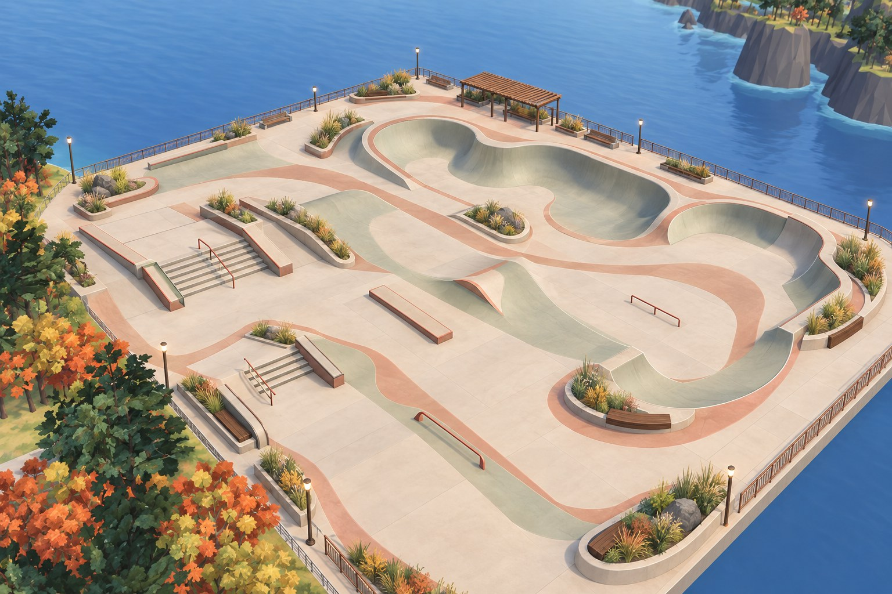

# Sunset Pier

A 112 × 88 m concrete skate park over the sea, reached by the existing 111 m downhill path. The north entrance
stays at the same world position; the pier grows east, west and seaward. Warm stone, sage transitions, rust tile,
red rails and timber seating follow five [Sunburst references](../../../assets/skatepark/concepts/prompts.json).
The reference images and their individual model/prompt provenance are committed alongside that file. The last
two use actual in-game captures to improve the original layout: connected terraces, a horseshoe return, a
rounded central wave and a bowl with skateable outer shoulders.



## Layout and lines

Coordinates below are park-local metres: east +X, north +Y, up +Z. The deck is at world `(-110, -212, 1.8)`.
Unreal converts world metres `(x,y,z)` to centimetres `(100x,-100y,100z)`.

| Area | Features and approach |
| --- | --- |
| Entry / north street | A wide arrival plaza at `(6,36)`. Two successive 8 m manual pads, 22 and 38 cm high, sit along Y=27.5 with a 6 m gap. Steel edges support manuals, slides and grinds. |
| West street terraces | A four-stair plaza at Y=6–17 and seven-stair plaza at Y=21–36. Each has a 14 m approach deck, two handrails with flat lead-ins and run-outs, two steel-edged hubbas, and a long filleted bank facing into the park. Stairs descend east into open flat. A smooth rise joins the two levels, with additional west and side banks for continuous lines. |
| Technical street | An additional 10 m ledge at Y=12–15. Three 8 m flat bars: 38 cm round red at Y=20, 30 cm square sage at Y=20, and 45 cm round red at Y=29. Bars occupy separate lanes with clear approaches. |
| Centre wave | An 85 cm hip at X=-21.1–1.1, Y=-8–5. Rounded banks meet a 6 m top; the sides taper smoothly to flat for diagonal transfers. |
| East return | A 16 m wide quarter at X=46, Y=18–34: 2 m radius, 15 cm vertical extension, coping and a 3 m deck. A south access bank connects the deck to the flat. |
| Horseshoe mini | Two 10 m straight opposing walls at X=-36 and -10, Y=-23–-13, joined by a 180° southern return. Each has a 2.5 m radius plus 15 cm of vert, with 21 m between the toes. The north side opens toward the centre wave; a bank reaches the west deck. The curved return has a skateable outer shoulder. |
| Bowl | Rounded rectangular bowl centred at `(29,-10)`. The floor spans 20 × 16 m at its widest; the coping spans 26 × 22 m. A 3 m transition radius plus 20 cm of vert gives 3.2 m depth. A 1.5 m perimeter deck meets a smooth 7 m wide bank on every exterior face. The floor stays at pier level, above the sea. |
| Promenade | A flowing terracotta floor ribbon, rounded garden planters, edge benches, grasses, lamps and a timber pergola overlooking the sea. Furniture stays outside the skating approaches. |

The broad banks supply speed for lines through the park. The bowl bank, for example, takes a 2 m/s start on its
upper deck to over 8 m/s on the flat without pushing in the native regression. Roll down facing the open flat,
then link into street or return transitions. A vertical coping lip is a drop-in/trick edge; it is not a mellow bank.

## Transitions and pumping

The quarter pipes and bowl reach **90°**, followed by a short vertical extension. They turn horizontal travel
upwards before the wheels leave the lip. The recovered air/trajectory solver then selects a return into the
transition. The steel coping is a continuous rounded shoulder, with no tube overlapping the riding surface or projecting into the front truck. Near a vertical departure the host removes the small averaged floor-normal tilt before native trajectory selection; this avoids falsely selecting a forward deck transfer. Explicit forward transfer input is retained. Low speeds can stall at the lip;
use the banks, push on the flat and pump to carry speed. The curved bowl corners support continuous carving.

On a controller, **hold either L2 or R2 to compress, then release to extend**. On keyboard, use **Q or E**.
Approach a wall compressed and release as you ride through its lower/middle transition. On the way back down,
compress high on the wall and extend through the lower curve. Compress again for the next wall. Stay off the
right-stick ollie input when practising pumping; it performs a separate pop. Triggers become grabs in the air,
so release them before the air unless you want a grab.

Pumping comes from the recovered centre-of-mass/ground-curvature controller. Timing matters: holding a trigger
continuously is not a speed boost. `check_skatepark_runtime.py` compares an identical 8.5 m/s bowl approach after
settling the rider. Releasing at 1.25 m board height gives an apex of 5.21 m versus 3.96 m while coasting, and a
return speed of 11.46 m/s versus 10.95 m/s. These are regression measurements for this geometry and tuning, not a
promise of those exact numbers for every player input or frame history.

## Build and verification

```sh
uv run atelier build yorimichi world.skatepark unreal.skatepark
python3 games/yorimichi/tools/check_skatepark_runtime.py
uv run atelier qa yorimichi skate_runtime
uv run atelier qa yorimichi skatepark
uv run atelier qa yorimichi skate_performance
```

The normal build owns the render lock and memory guard. Wait for the shared render slot when another job is
using it. Review renders are available through `build.py --review`, also under `atelier.safety`.

- `layout.py` owns dimensions, profiles, floor grid, rail contact lines and the terrain-following path.
- `features.py` builds the riding geometry, pier, path, furniture and planting; `geom.py` supplies mesh/export tools.
- `board.py` builds the 80 × 20.5 cm deck, trucks and wheels used by the solved board rig.
- `build.py` checks tangent joins, rail-to-mesh alignment, path grades/terrain clearance and FBX units/axes.
- `park.json` is the committed placement, spawn, clearance, asset and rail contract consumed by `ASkatePark`.
- `review.py` renders overview, street, bowl, mini-ramp, entrance and rail-plan views.

Disposable FBX files, blend scene, review images, collision snapshot and reports go to `build/yorimichi/skatepark/`.
The Unreal importer stages the generated meshes in ignored Content with the existing vertex-colour material.
All blocking park meshes use their render triangles for collision. Planting and floor paint are visual only.
The pier is about 151k triangles including its piles, path, furniture and paint; rail contact lines match the
modelled surface within 0.03 mm. The path remains below a 10% grade on both edges and clears the terrain by 5 cm.

The native regression verifies upward launch, an apex above coping and recontact on the curved face, plus
consecutive mini-ramp airs, the bank roll-in and the pumping comparison. The in-game suite also covers walking
mounts, Triangle toggling, coasting pose stability, tricks, rails, slides, retargeting and bail skin clearance.

Flying leaves are excluded from the pier footprint, including when viewed from the approach. Their simulation
is suspended while the player is inside. Park-local lighting uses the authored vertex shading, skylight and
direct shadows to avoid unstable Lumen indirect-light patches on the large, thin riding surfaces.

`skate_performance` measures wall-clock frame intervals at the normal frame cap while pushing, flipping,
riding transitions, crossing the park and bailing. It records mean FPS, 95th/99th-percentile frame time,
long frames and repeated native poses in `build/yorimichi/skateqa/performance.json`; it does not use fixed-step
video capture. The park origin anchors collision snapshots so moving between its corners does not rebuild them.
